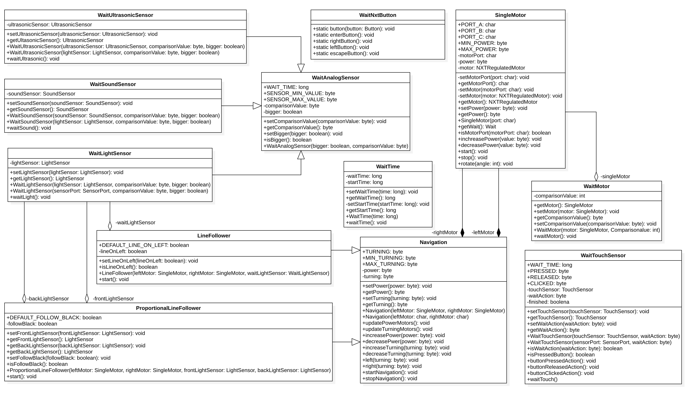

# Libreria LEGO | Diario di lavoro - 16.01.2019
##### Gabriele Alessi, Giulio Bosco
### Canobbio, 16.01.2019

## Lavori svolti

Durante questa giornata abbiamo continuato con l'implementazione del progetto e anche documentato alcune classi.  
Ad esempio questa è la classe `WaitDigitalSensor`:

```
- PRESSED: È una costante che indica la pressione di un pulsante.
- RELEASED: È una costante che indica il rilascio di un pulsante.
- CLICKED: È una costante che indica il click di un pulsante.
- waitAction: Attributo che rappresenta l'azione eseguita sul pulsante (PRESSED, RELEASED, CLICKED).
- isWaitAction(): Metodo che indica se l'azione fatta sul pulsante è valida.
- getWaitAction(): Metodo che serve per ottenere l'azione sul pulsante.
- setWaitAction(): Metodo utile per impostare l'azione.
- Costruttore: Istanzia un nuovo `WaitDigitalSensor` impostando l'azione.
- isPressedButton(): Metodo che ritorna `true` se il pulsante è premuto.
- buttonPressedAction(): Metodo che aspetta quando un pulsante è premuto.
- buttonReleasedAction(): Metodo che aspetta quando un pulsante è rilasciato.
- buttonClickedAction(): Metodo che aspetta quando un pulsante è cliccato (premuto e rilasciato).
- run(): È il metodo principale in cui si aspetta quando il pulsante viene cliccato.
```

È stato caricato il nuovo diagramma delle classi, in cui la struttura è la definizione delle classi sono più definiti e vicini al risultato finale.



E questa è l'implementazione del metodo principale della classe `WaitDigitalSensor`, dove si usano dei metodi di aiuto che identificano l'azione eseguita su un sensore digitale (pulsante) e aspetta in base a essa.

```
public void run() {
        while (this.isFinished()) {
            try {
                if (this.getWaitAction() == PRESSED) {
                    this.buttonPressedAction();
                } else if (this.getWaitAction() == RELEASED) {
                    this.buttonReleasedAction();
                } else if (this.getWaitAction() == CLICKED) {
                    this.buttonClickedAction();
                }
                Thread.sleep(WAIT_TIME);
            } catch (InterruptedException ignored) {

            }
        }
    }
```

|Orario        |Lavoro svolto					|
|--------------|------------------------------	|
|13:15 - 14:45 |Implementazione|

##  Problemi riscontrati e soluzioni adottate
Nessun problema riscontrato.
##  Punto della situazione rispetto alla pianificazione
In linea con la pianificazione.
## Programma di massima per la prossima giornata di lavoro
Continuazione implementazione metodi e documentazione.