<style>
th, td {
    padding:2px 5px!important;
}
</style>

# Sistema didattico per LEGO NTX con libreria e documentazione

## Indice

<div class="clearfix index">
    <div class="capitle" style="width:80%;float:left;border-bottom:1px dotted #DDDDDD;"><h5>Capitolo</h5></div>
    <div class="page" style="text-align:right;width:20%;float:left;border-bottom:1px dotted #DDDDDD;"><h5>Pagina</h5></div>
    <div style="margin-top:5px;widht:100%;"> </div>
    <div class="capitle" style="width:80%;float:left;border-bottom:1px dotted #DDDDDD;">Introduzione</div>
        <div class="page" style="text-align:right;width:20%;float:left;border-bottom:1px dotted #DDDDDD;">3</div>
        <div style="margin-top:5px;widht:100%;"> </div>
        <div class="capitle" style="width:80%;float:left;border-bottom:1px dotted #DDDDDD;">&emsp;Informazione sul progetto</div>
        <div class="page" style="text-align:right;width:20%;float:left;border-bottom:1px dotted #DDDDDD;">3</div>
        <div style="margin-top:5px;widht:100%;"> </div>
        <div class="capitle" style="width:80%;float:left;border-bottom:1px dotted #DDDDDD;">&emsp;Abstrat</div>
        <div class="page" style="text-align:right;width:20%;float:left;border-bottom:1px dotted #DDDDDD;">3</div>
        <div style="margin-top:5px;widht:100%;"> </div>
        <div class="capitle" style="width:80%;float:left;border-bottom:1px dotted #DDDDDD;">&emsp;Scopo</div>
        <div class="page" style="text-align:right;width:20%;float:left;border-bottom:1px dotted #DDDDDD;">3</div>
    <div class="capitle" style="width:80%;float:left;border-bottom:1px dotted #DDDDDD;">Analisi</div>
    <div class="page" style="text-align:right;width:20%;float:left;border-bottom:1px dotted #DDDDDD;">4</div>
        <div class="capitle" style="width:80%;float:left;border-bottom:1px dotted #DDDDDD;">&emsp;Analisi del dominio</div>
        <div class="page" style="text-align:right;width:20%;float:left;border-bottom:1px dotted #DDDDDD;">4</div>
        <div class="capitle" style="width:80%;float:left;border-bottom:1px dotted #DDDDDD;">&emsp;Analisi e specifica dei requisiti</div>
        <div class="page" style="text-align:right;width:20%;float:left;border-bottom:1px dotted #DDDDDD;">4</div>
        <div class="capitle" style="width:80%;float:left;border-bottom:1px dotted #DDDDDD;">&emsp;Analisi dei mezzi</div>
        <div class="page" style="text-align:right;width:20%;float:left;border-bottom:1px dotted #DDDDDD;">6</div>
            <div class="capitle" style="width:80%;float:left;border-bottom:1px dotted #DDDDDD;">
                &emsp;&emsp;Software
            </div>
            <div class="page" style="text-align:right;width:20%;float:left;border-bottom:1px dotted #DDDDDD;">6</div>
            <div class="capitle" style="width:80%;float:left;border-bottom:1px dotted #DDDDDD;">
                &emsp;&emsp;Hardware
            </div>
            <div class="page" style="text-align:right;width:20%;float:left;border-bottom:1px dotted #DDDDDD;">6</div>
        <div class="capitle" style="width:80%;float:left;border-bottom:1px dotted #DDDDDD;">
            &emsp;Pianificazione
        </div>
            <div class="page" style="text-align:right;width:20%;float:left;border-bottom:1px dotted #DDDDDD;">7</div>
    <div class="capitle" style="width:80%;float:left;border-bottom:1px dotted #DDDDDD;">
        Progettazione
    </div>
    <div class="page" style="text-align:right;width:20%;float:left;border-bottom:1px dotted #DDDDDD;">8</div>
        <div class="capitle" style="width:80%;float:left;border-bottom:1px dotted #DDDDDD;">
            &emsp;Design dell'architettura
        </div>
        <div class="page" style="text-align:right;width:20%;float:left;border-bottom:1px dotted #DDDDDD;">5</div>
            <div class="capitle" style="width:80%;float:left;border-bottom:1px dotted #DDDDDD;">
                &emsp;&emsp;Struttura del sistema
            </div>
            <div class="page" style="text-align:right;width:20%;float:left;border-bottom:1px dotted #DDDDDD;">8</div>
            <div class="capitle" style="width:80%;float:left;border-bottom:1px dotted #DDDDDD;">
                &emsp;&emsp;Diagramma delle classi
            </div>
            <div class="page" style="text-align:right;width:20%;float:left;border-bottom:1px dotted #DDDDDD;">10</div>
            <div class="capitle" style="width:80%;float:left;border-bottom:1px dotted #DDDDDD;">
                &emsp;&emsp;Componenti
            </div>
            <div class="page" style="text-align:right;width:20%;float:left;border-bottom:1px dotted #DDDDDD;">11</div>
                <div class="capitle" style="width:80%;float:left;border-bottom:1px dotted #DDDDDD;">
                    &emsp;&emsp;&emsp;Sensori
                </div>
                <div class="page" style="text-align:right;width:20%;float:left;border-bottom:1px dotted #DDDDDD;">11</div>
                <div class="capitle" style="width:80%;float:left;border-bottom:1px dotted #DDDDDD;">
                    &emsp;&emsp;&emsp;Attuatori
                </div>
                <div class="page" style="text-align:right;width:20%;float:left;border-bottom:1px dotted #DDDDDD;">11</div>
    <div class="capitle" style="width:80%;float:left;border-bottom:1px dotted #DDDDDD;">
        Implementazione
    </div>
    <div class="page" style="text-align:right;width:20%;float:left;border-bottom:1px dotted #DDDDDD;">12</div>
        <div class="capitle" style="width:80%;float:left;border-bottom:1px dotted #DDDDDD;">
            &emsp;HelloWorld
        </div>
        <div class="page" style="text-align:right;width:20%;float:left;border-bottom:1px dotted #DDDDDD;">14</div>
            <div class="capitle" style="width:80%;float:left;border-bottom:1px dotted #DDDDDD;">
                &emsp;&emsp;Test HelloWorld
            </div>
            <div class="page" style="text-align:right;width:20%;float:left;border-bottom:1px dotted #DDDDDD;">14</div>
        <div class="capitle" style="width:80%;float:left;border-bottom:1px dotted #DDDDDD;">
            &emsp;WaitAnalogSensor
        </div>
        <div class="page" style="text-align:right;width:20%;float:left;border-bottom:1px dotted #DDDDDD;">15</div>
        <div class="capitle" style="width:80%;float:left;border-bottom:1px dotted #DDDDDD;">
            &emsp;WaitLightSensor
        </div>
        <div class="page" style="text-align:right;width:20%;float:left;border-bottom:1px dotted #DDDDDD;">16</div>
        <div class="capitle" style="width:80%;float:left;border-bottom:1px dotted #DDDDDD;">
            &emsp;WaitMotor
        </div>
        <div class="page" style="text-align:right;width:20%;float:left;border-bottom:1px dotted #DDDDDD;">17</div>
        <div class="capitle" style="width:80%;float:left;border-bottom:1px dotted #DDDDDD;">
            &emsp;WaitNxtButton
        </div>
        <div class="page" style="text-align:right;width:20%;float:left;border-bottom:1px dotted #DDDDDD;">18</div>
        <div class="capitle" style="width:80%;float:left;border-bottom:1px dotted #DDDDDD;">
            &emsp;WaitSoundSensor
        </div>
        <div class="page" style="text-align:right;width:20%;float:left;border-bottom:1px dotted #DDDDDD;">19</div>
        <div class="capitle" style="width:80%;float:left;border-bottom:1px dotted #DDDDDD;">
            &emsp;WaitTime
        </div>
        <div class="page" style="text-align:right;width:20%;float:left;border-bottom:1px dotted #DDDDDD;">20</div>
        <div class="capitle" style="width:80%;float:left;border-bottom:1px dotted #DDDDDD;">
            &emsp;WaitSoundSensor
        </div>
        <div class="page" style="text-align:right;width:20%;float:left;border-bottom:1px dotted #DDDDDD;">21</div>
        <div class="capitle" style="width:80%;float:left;border-bottom:1px dotted #DDDDDD;">
            &emsp;WaitUltrasonicSensor
        </div>
        <div class="page" style="text-align:right;width:20%;float:left;border-bottom:1px dotted #DDDDDD;">24</div>
        <div class="capitle" style="width:80%;float:left;border-bottom:1px dotted #DDDDDD;">
            &emsp;SingleMotor
        </div>
        <div class="page" style="text-align:right;width:20%;float:left;border-bottom:1px dotted #DDDDDD;">25</div>
        <div class="capitle" style="width:80%;float:left;border-bottom:1px dotted #DDDDDD;">
            &emsp;Navigation
        </div>
        <div class="page" style="text-align:right;width:20%;float:left;border-bottom:1px dotted #DDDDDD;">28</div>
        <div class="capitle" style="width:80%;float:left;border-bottom:1px dotted #DDDDDD;">
            &emsp;LineFollower
        </div>
        <div class="page" style="text-align:right;width:20%;float:left;border-bottom:1px dotted #DDDDDD;">32</div>
        <div class="capitle" style="width:80%;float:left;border-bottom:1px dotted #DDDDDD;">
            &emsp;ProportionalLineFollower
        </div>
        <div class="page" style="text-align:right;width:20%;float:left;border-bottom:1px dotted #DDDDDD;">33</div><div class="page-break"></div>
    <div class="capitle" style="width:80%;float:left;border-bottom:1px dotted #DDDDDD;">
        Test
    </div>
    <div class="page" style="text-align:right;width:20%;float:left;border-bottom:1px dotted #DDDDDD;">35</div>
        <div class="capitle" style="width:80%;float:left;border-bottom:1px dotted #DDDDDD;">
            &emsp;Protocollo di test
        </div>
        <div class="page" style="text-align:right;width:20%;float:left;border-bottom:1px dotted #DDDDDD;">35</div>
        <div class="capitle" style="width:80%;float:left;border-bottom:1px dotted #DDDDDD;">
            &emsp;Risultati test
        </div>
        <div class="page" style="text-align:right;width:20%;float:left;border-bottom:1px dotted #DDDDDD;">19</div>
    <div class="capitle" style="width:80%;float:left;border-bottom:1px dotted #DDDDDD;">
        Consuntivo
    </div>
    <div class="page" style="text-align:right;width:20%;float:left;border-bottom:1px dotted #DDDDDD;">19</div>
    <div class="capitle" style="width:80%;float:left;border-bottom:1px dotted #DDDDDD;">
        Conclusioni
    </div>
    <div class="page" style="text-align:right;width:20%;float:left;border-bottom:1px dotted #DDDDDD;">19</div>
        <div class="capitle" style="width:80%;float:left;border-bottom:1px dotted #DDDDDD;">
            &emsp;Sviluppi futuri
        </div>
        <div class="page" style="text-align:right;width:20%;float:left;border-bottom:1px dotted #DDDDDD;">19</div>
        <div class="capitle" style="width:80%;float:left;border-bottom:1px dotted #DDDDDD;">
            &emsp;Considerazioni personali
        </div>
        <div class="page" style="text-align:right;width:20%;float:left;border-bottom:1px dotted #DDDDDD;">19</div>
        <div class="capitle" style="width:80%;float:left;border-bottom:1px dotted #DDDDDD;">
            &emsp;Sitografia
        </div>
        <div class="page" style="text-align:right;width:20%;float:left;border-bottom:1px dotted #DDDDDD;">19</div>
    <div class="capitle" style="width:80%;float:left;border-bottom:1px dotted #DDDDDD;">
        Allegati
    </div>
    <div class="page" style="text-align:right;width:20%;float:left;border-bottom:1px dotted #DDDDDD;">19</div>
</div>

<div class="page-break"></div>

## Introduzione

### Informazioni sul progetto

- Allievi: Gabriele Alessi, Giulio Bosco  
Docenti e supervisori: Adriano Barchi, Luca Muggiasca, Francesco Mussi, Massimo Sartori
- Scuola d'Arti e Mestieri di Trevano, sezione Informatica, Classe 3, Modulo 306
- Data inizio: 14.11.2018  
Data fine: 08.02.2019

### Abstract

> In this document we describe how we developed the "LEGO Library" product: a library developed in
> Java useful for automating the most common operations when programming LEGO robots. For example,
> reading data received from a sensor or moving operations with actuators. These libraries will be
> mainly used by the computer scientists of the second year class of the Trevano School of Arts and
> Crafts to implement the programs for the WRO (World Robot Olympiad) and FLL (First LEGO League).
> This collection of functions  will allow users to focus more on the main problem to be solved by
> already having the basic operations implemented and tested.

### Scopo

Questo prodotto ha l'obiettivo di semplificare la parte di implementazione quando si sta sviluppando un progetto con dei robot LEGO&#174; Mindstorms. Il frutto del mandato comprende una libreria in grado di eseguire le funzioni più basilari e fondamentali che un robot deve svolgere durante una missione.

<div class="page-break"></div>

## Analisi

### Analisi del dominio

Fino a ora, gli allievi della sezione Informatica delle classi prima e seconda, implementavano manualmente anche le più semplici attività (seguire una linea, fermarsi di fronte a un ostacolo, ...) che i robot LEGO&#174; Mindstorms dovessero compiere. Quindi lo scopo di questo prodotto sarebbe quello di offrire una libreria che agevoli il lavoro degli utenti eliminando le parti di realizzazione più semplici e ripetitive. Il risultato sarà facile da utilizzare e lo sarà in varie situazioni, in quanto è sviluppato nel linguaggio Java.

### Analisi e specifica dei requisiti

La specifica dei requisiti del progetto è rappresentata tramite tabelle che definiscono le basi del prodotto. Le tabelle vengono elencate in base alla priorità e all'importanza del requisito.

|ID  |REQ-01                                          |
|----|------------------------------------------------|
|**Nome**    |Installazione del firmware|
|**Priorità**|1                     |
|**Versione**|2.0                   |
|**Note**    |È necessario installare il firmware leJOS (Java) su NXT.|
| *Sub-req 1* |Produrre una guida per l'installazione del firmware|

|ID  |REQ-02                                          |
|----|------------------------------------------------|
|**Nome**    |Verifica componenti|
|**Priorità**|1                     |
|**Versione**|2.2                   |
|**Note**    |È necessario testare ogni componente utilizzato durante la realizzazione del progetto.|
| *Sub-req 1* |Testare componenti (6 tra sensori e attuatori) su NXT con leJOS|

|ID  |REQ-03                                          |
|----|------------------------------------------------|
|**Nome**    |Sviluppo blocchetti arancioni|
|**Priorità**|1                     |
|**Versione**|3.0                   |
|**Note**    |Creare delle classi che simulino i blocchetti arancioni dell'ambiente di sviluppo Mindstorms.|
| *Sub-req 1* |Sensore di luce |
| *Sub-req 2* |Sensore di tocco |
| *Sub-req 3* |Sensore a ultrasuoni (distanza) |
| *Sub-req 4* |Microfono |
| *Sub-req 5* |Pulsanti del brick |
| *Sub-req 6* |Motore |
| *Sub-req 7* |Tempo |

<div class="page-break"></div>

|ID  |REQ-04                                          |
|----|------------------------------------------------|
|**Nome**    |Sviluppo blocchetti verdi|
|**Priorità**|1                     |
|**Versione**|3.0                   |
|**Note**    |Ogni attuatore deve avere dei metodi per controllarlo.|
| *Sub-req 1* |Motore |
| *Sub-req 2* |Navigazione a due motori |

|ID  |REQ-05                                          |
|----|------------------------------------------------|
|**Nome**    |LineFollower proporzionale|
|**Priorità**|1                     |
|**Versione**|2.0                   |
|**Note**    |È necessario implementare la funzione "LineFollower" in modo proporzionale e facile da utilizzare.|

<div class="page-break"></div>

### Analisi dei mezzi

#### Software

I software usati comprendono quelli presenti sui nostri PC e il firmware per il brick:
- leJOS: è una Java Virtual Machine adattata per i brick NXT e EV3.  
*Link:* [http://www.lejos.org/](http://www.lejos.org/)  
*Versione:* NXJ 0.9.1
- Visual Studio Code 1.29.1
- GitHub Desktop 1.5.0
- GanttProject 2.8.9 Pilsen
- StarUML 3.0.2
- NetBeans IDE 8.2
- Windows PowerShell ISE Host 5.1.17134.407
- Atom 1.34.0

#### Hardware

Per la realizzazione del prodotto ci siamo serviti dei nostri computer portatili e di un brick:
- Apple MacBook Pro 15" 2018, Processore Intel&reg; Core I7, RAM 16GB, Disk 1TB SSD, Mac OS X 10.14.1
- HP ENVY Notebook, Intel&reg; Core I7, RAM 16GB, Windows 10 Home 64 bit
- Brick LEGO&reg; NXT

<div class="page-break"></div>

<br><br><br><br><br><br><br><br><br><br><br><br>
<div style="-webkit-transform: rotate(90deg);-moz-transform: rotate(90deg);-o-transform: rotate(90deg);-ms-transform: rotate(90deg);transform: rotate(90deg);width:650px;">
    <h3>Pianificazione</h3>
    <p>La pianificazione del progetto è stata effettuata mediante la realizzazione di un diagramma di Gantt.</p>
    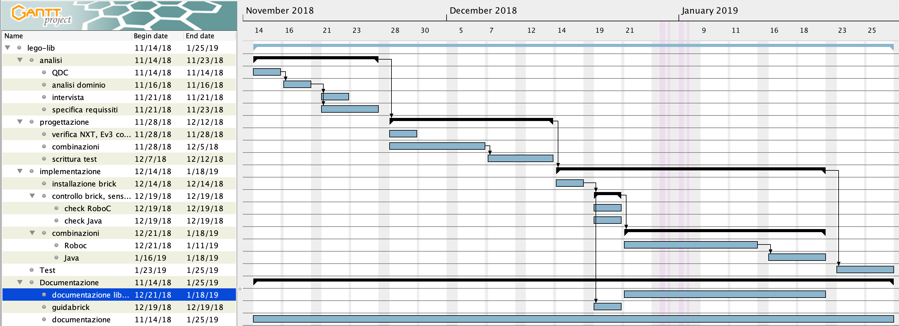
</div>

<div class="page-break"></div>

## Progettazione

### Design dell’architettura del sistema

In questo settore viene spiegato come è stata ideata la struttura del sistema e in che modo i singoli componenti e moduli sono legati tra loro.

#### Struttura del sistema

Lego lib deve essere suddiviso in pacchetti, per mantenere una struttura ordinata dei file. Il
pacchetto principale `ch.ti.cpttrevano.samt.legolib`.

- ch.ti.cpttrevano.samt.legolib
    - calibration
        - LightSensorCalibrator.java
    - linefollower
        - LineFollower.java
        - ProportionalLineFollower.java
    - motor
        - Navigation
        - SingleMotor.java
    - test
        - HelloWorld.java
        - LineFollower.java
        - TestLightSensor.java
        - TestMotor.java
        - TestNxtButton.java
        - TestSoundSensor.java
        - TestUltrasonicSensor.java
        - LFRunner.java
        - PLFRunner.java
    - use
        - UseThreadSleep.java
        - UseWaitLightSensor.java
        - UseWaitMotor.java
        - UseWaitNxtButton.java
        - UseWaitSoundSensor.java
        - UseWaitTime.java
        - UseWaitTouchSensor.java
        - UseWaitUltrasonicSensor.java<br><br><br><br>
    - wait
        - WaitAnalogSensor.java
        - WaitLightSensor.java
        - WaitMotor.java
        - WaitNxtButton.java
        - WaitSoundSensor.java
        - WaitTime.java
        - WaitTouchSensor.java
        - WaitUltrasonicSensor.java
- out
- classes.jar
- compile.ps1

<div class="page-break"></div>

<br><br><br><br>
<div style="-webkit-transform: rotate(90deg);-moz-transform: rotate(90deg);-o-transform: rotate(90deg);-ms-transform: rotate(90deg);transform: rotate(90deg);width:650px;">
    <p>&nbsp;</p><p>&nbsp;</p><p>&nbsp;</p><p>&nbsp;</p>
    <h4 style="padding-top:20px;">Diagramma delle classi</h4>
    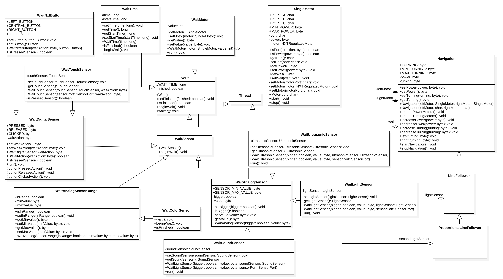<p>&nbsp;</p>
    <p>La libreria è basata su due tipi di classi: delle classi per il movimento e delle classi per gli
    `Wait`, che servono per "aspettare" degli eventi. Ad esempio aspettare del tempo, o la pressione di un
    pulsante, oppure che un sensore legga un determinato valore. Gli `Wait` possono essere eseguiti in
    maniera sincrona (un'istruzione dopo l'altra) oppure asincrona (eseguire più istruzioni contemporaneamente). </p>
</div>

<div class="page-break"></div>

#### Componenti

I componenti possono essere di due tipi, sensori ed attuatori.  
Per ogni sensore ci deve essere un metodo per la lettura dei dati letti dal sensore. Mentre gli attuatori devono avere dei metodi per il loro controllo e delle funzioni che ricavano dei dati in base ai movimenti effettuati. Per esempio il conteggio di rotazioni del motore durante un'azione.

##### Sensori

- *LightSensor*, misura l'intensità di luce riflessa.
- *UltrasonicSensor*, misura la distanza fra il sensore e l'ostacolo davanti a esso.
- *SoundSensor*, misura il suono (microfono).
- *TouchSensor*, controlla semplicemente se è premuto il sensore.
- *NxtButton*, legge i pulsanti presenti sul brick.

##### Attuatori

- *SingleMotor*, il motore più potente per i LEGO&reg; Mindstorms.

<div class="page-break"></div>

## Implementazione

Il capitolo di implementazione mostra in poche parole la messa in atto della progettazione. Tutte le classi presenti nel diagramma vengono qui spiegate più nel dettaglio illustrando i metodi e le parti di codice tramite screenshots o rappresentazioni o schemi e tabelle.

L'implementazione del prodotto è composta da delle classi `Wait` che servono per aspettare che succeda qualcosa, ad esempio che un sensore legga un certo valore oppure aspettare del tempo. Ogni classe di questo tipo ha la sua classe di utilizzo, cioè del semplice codice utile per testare il corretto funzionamento dell'attesa. Poi ci sono le classi che permettono di controllare gli attuatori per muovere il robot (`SingleMotor`, `Navigation`). Infine ci sono le classi più complesse, dove più moduli vengono uniti per creare classi come `LineFollower` e `ProportionalLineFollower`.

Durante lo sviluppo di lego lib, mentre abbiamo iniziato a testare le classi ci siamo accorti che
con tutti i package compilare le classi e caricarle sul brick NXT diventava molto complicato quindi
abbiamo deciso di rimuovere tutti i pacchetti e mettere tutti i file in un unica cartella.
Meno le classi per testare i sensori che sono nella cartella `src/test/`.

Nuova struttura dei file e delle cartelle

- src
    - `*.java`
    - test
        - `Test*.java`

In oltre abbiamo scoperto un bug presente nella JVM leJOS per LEGO&reg; Mindstorm NXT, quando si
eseguono due processi (`Thread`), contemporaneamente la JVM non riescie ad eseguire le comparazioni
di valori.  
A differenza di quello che è scritto nella documentazione ufficiale di leJOS.
Questo non permette il corretto funzionamento delle classi, perché tutte le funzioni asincrone non
potevano funzionare, ma siccome le funzioni sincrone erano basate su quelle asincrone, per non dover
riscrivere due volte il codice, tutte le classi che erano state scritte non funzionavano pi&ugrave;.  
Per questo abbiamo dovuto riprendere in mano la progettazione e riprogettare l'intero sistema.

Con il nuovo sistema non &egrave; pi&ugrave; possibile eseguire operazioni asincrone ed &egrave;
stata tolta anche tutta la generalizzazione che era stata fatta prima, il funzionamento delle classi
&egrave; stato semplificato.

<div class="page-break"></div>

<br><br><br>
<div style="-webkit-transform: rotate(90deg);-moz-transform: rotate(90deg);-o-transform: rotate(90deg);-ms-transform: rotate(90deg);transform: rotate(90deg);width:650px;">
    <p>&nbsp;</p><p>&nbsp;</p><p>&nbsp;</p><p>&nbsp;</p>
    <h4 style="padding-top:20px;">Diagramma delle classi</h4>
    <p>&nbsp;</p>
    <p>Nella nuova progettazione non vi sono pi&ugrave; tutte le ereditariet&agrave; e le relazioni
    fra le classi. Quindi &egrave; stato semplificato molto il codice. &Egrave; rimasta pero la
    relazione fra le classi <code>Wait</code> dei sensori analogici, per scrivere una volta sola (nella
    classe <code>WaitAnalogSensor</code>) la logica dei valori, <code>comparisonValue</code> e
    <code>bigger</code>.</p>
</div>

<div class="page-break"></div>


### HelloWorld

Questa classe è stata usata come test per iniziare a capire come implementare un programma Java in un brick NXT e per essere usata come esempio nella guida per configurare leJOS su Windows. È presente solo il metodo `main` con due classiche funzioni che insieme formano semplicemente l'output "Hello World".
```java
package test;
import lejos.nxt.Button;

/**
 * Hello World.
 * Stampa "Hello World" sul display LCD del brick NXT.
 *
 * @author gabrielealessi
 * @version 1.0 (2019-02-07)
 */
public class HelloWorld {
    /**
     * Metodo main della classe, stampa "Hello World".
     *
     * @param args Argomenti da linea di comando.
     */
    public static void main(String[] args) {
        // Stampo "Hello World".
        System.out.println("Hello World");
        // Attesa della pressione di un pulsante per terminare il test.
        Button.waitForAnyPress();
    }
}
```

#### Test HelloWorld

Per verificare il giusto funzionamento della classe l'abbiamo caricata sul brick e l'abbiamo avviata.
Sulla guida `usareLegoLib` è spiegato come compilare e caricare programmi Java sul NXT.  
Questo è il risultato ottenuto:

<p style="text-align:center;">

</p>

<div class="page-break"></div>

### WaitAnalogSensor

Classe che serve per generalizzare le classi che aspettano un sensore analogico (microfono, tocco, ultrasuoni).

<p style="text-align:center;">

</p><br>

- WAIT_TIME: Costante che definisce l'intervallo di tempo tra un controllo e un altro della fine dell'attesa. Valore: 100 (millisecondi).
- SENSOR_MIN_VALUE: Costante che definisce il minimo valore che un sensore può leggere. Valore: 0.
- SENSOR_MAX_VALUE: Costante che definisce il massimo valore che un sensore può leggere. Valore: 100.
- comparisonValue: Attributo che rappresenta il valore da comparare con quello letto dal sensore.
- bigger: Attributo che indica se il valore letto deve essere maggiore o minore di quello di confronto.
- getComparisonValue(): Metodo che serve per ottenere il valore di confronto.
- isBigger(): Metodo utile per sapere il valore dell'attributo `bigger`.
- setComparisonValue(): Metodo utile per impostare il valore di confronto controllando che sia nell'intervallo definito da `SENSOR_MIN_VALUE` e `SENSOR_MAX_VALUE`.
    ```java
    /**
     * Setta il comparison value.
     * Controlla che il valore sia maggiore del valore minimo e minore del valore massimo.
     *
     * @param comparisonValue Valore di riferimento.
     */
    public void setComparisonValue(byte comparisonValue) {
        // Controllo che sia maggiore del valore minimo e minore del valore massimo.
        if (comparisonValue >= SENSOR_MIN_VALUE && comparisonValue <= SENSOR_MAX_VALUE) {
            // Assegno il valore.
            this.comparisonValue = comparisonValue;
        }
    }
    ```
- setBigger(): Metodo utile per impostare il valore dell'attributo `bigger`.
- WaitAnalogSensor(): Metodo costruttore, istanzia un nuovo `WaitAnalogSensor`, defininendo il campo `bigger` e il valore per comparare.

<div class="page-break"></div>

### WaitLightSensor

Classe figlia di `WaitAnalogSensor` che aspetta che il sensore di luce percepisca un certo valore.

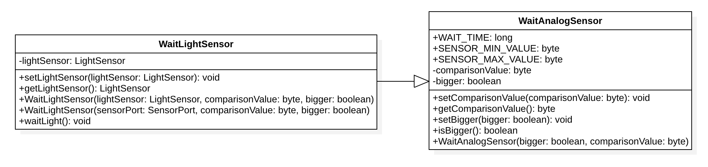

- lightSensor: Attributo che rappresenta il sensore di luce.
- getLightSensor(): Metodo che serve per ottenere il sensore.
- setLightSensor(): Metodo utile per impostare il sensore.
- WaitLightSensor(): Metodo costruttore, istanzia un nuovo `WaitLightSensor` impostando il valore di confronto, se il valore letto deve essere maggiore di quello di confronto e il sensore o la porta del brick in cui è inserito il sensore.
- waitLight(): È il metodo principale che termina l'attesa in base al valore di confronto.
    ```java
    /**
     * Aspetta il sensore di luce secondo i parametri memorizzati negli attributi della classe.
     */
    public void waitLight() {
        // Setta a false la variabile finished, la quale permette di uscire dal ciclo while.
        boolean finished = false;
        while (!finished) {
            // Finché non è finito eseguo il seguente codice.
            try {
                if (this.isBigger()) {
                    // Se deve essere maggiore confronto il valore del sensore di luce e quello di
                    // riferimento (comparisonValue) assegno a finished il risultato.
                    finished = this.getLightSensor().getLightValue() > this.getComparisonValue();
                } else {
                    // Se deve essere minore confronto i valori come prima ma al contrario.
                    finished = this.getLightSensor().getLightValue() < this.getComparisonValue();
                }

                // Aspetto WAIT_TIME (100 millis) fra un ciclo e l'altro.
                Thread.sleep(WAIT_TIME);
            } catch (InterruptedException ignored) {
            }
        }
    }
    ```

<div class="page-break"></div>

### WaitMotor

Classe che serve per aspettare che un motore faccia un certo numero di rotazioni.

<p style="text-align:center;">

</p>

- singleMotor: Attributo che rappresenta il motore grande (`SingleMotor`).
- comparisonValue: Attributo che rappresenta il valore da comparare con quello ricevuto dal motore.
- getSingleMotor(): Metodo che serve per ottenere il motore.
- getComparisonValue(): Metodo che serve per ottenere il valore di confronto.
- setSingleMotor(): Metodo utile per impostare il motore.
- setComparisonValue(): Metodo utile per impostare il valore di confronto.
- WaitMotor(): Metodo costruttore, istanzia un nuovo `WaitMotor` impostando il motore e il valore di confronto.
- waitMotor(): È il metodo principale che termina l'attesa quando il motore raggiunge le rotazioni determinate.
    ```java
    /**
     * Aspetta le rotazioni dei motori.
     */
    public void waitMotor() {
        // Setta a false la variabile finished, la quale permette di uscire dal ciclo while.
        boolean finished = false;
        while (!finished) {
            // Finché non è finito eseguo il codice seguente.
            try {
                // Rotazioni attuali.
                int earlyRotations = this.getSingleMotor().getMotor().getTachoCount();
                while (earlyRotations + this.getComparisonValue() != earlyRotations) {
                    // Finché le rotazioni sono maggiori di quelle attuali aspetta.
                    Thread.sleep(1000);
                }
                finished = true;
            } catch (InterruptedException ignored) {
            }
        }
    }
    ```

<div class="page-break"></div>

### WaitNxtButton

Classe utile per aspettare la pressione di uno dei pulsanti presenti sul brick NXT. L'implementazione è molto semplice poiché esiste la classe `Button` che contiene il necessario per far funzionare correttamente l'attesa.

<p style="text-align:center;">
    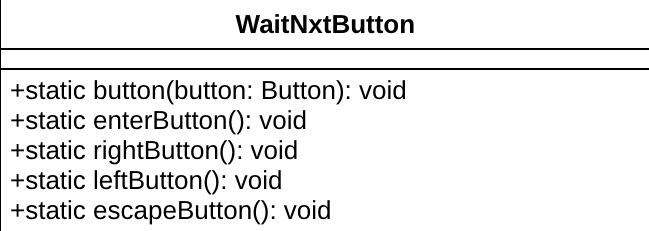
</p>

- button(): Metodo che aspetta la pressione del pulsante passato.
    ```java
    /**
     * Aspetta che venga premuto un bottone.
     *
     * @param button Bottone da aspettare.
     */
    public static void button(Button button) {
        // Attesa della pressione del pulsante specificato.
        button.waitForPress();
    }
    ```
- enterButton(): Metodo che aspetta la pressione del pulsante centrale.
    ```java
    /**
     * Aspetta il bottone enter.
     */
    public static void enterButton() {
        // Richiama il metodo per aspettare un bottone con il bottone enter come parametro
        button(Button.ENTER);
    }
    ```
- rightButton(): Metodo che aspetta la pressione del pulsante destro.
    ```java
    /**
     * Aspetta il bottone destro.
     */
    public static void rightButton() {
        // Richiama il metodo per aspettare un bottone con il bottone destro come parametro
        button(Button.RIGHT);
    }
    ```
- leftButton(): Metodo che aspetta la pressione del pulsante sinistro.
    ```java
    /**
     * Aspetta il bottone sinistro.
     */
    public static void leftButton() {
        // Richiama il metodo per aspettare un bottone con il bottone enter come parametro
        button(Button.LEFT);
    }
    ```
- escapeButton(): Metodo che aspetta la pressione del pulsante in basso.
    ```java
    /**
     * Aspetta il bottone indietro.
     */
    public static void escapeButton() {
        // Richiama il metodo per aspettare un bottone con il bottone enter come parametro
        button(Button.ESCAPE);
    }
    ```

<div class="page-break"></div>

### WaitSoundSensor

Classe figlia di `WaitAnalogSensor` che aspetta che il microfono percepisca un certo valore.

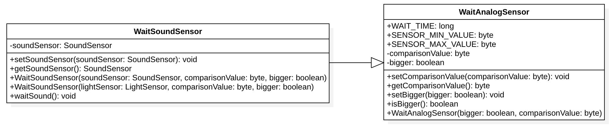

- soundSensor: Attributo che rappresenta il sensore di suono (microfono).
- getSoundSensor(): Metodo che serve per ottenere il microfono.
- setSoundSensor(): Metodo utile per impostare il microfono.
- WaitSoundSensor(): Metodo costruttore, istanzia un nuovo `WaitSoundSensor` impostando il valore di confronto, se il valore letto deve essere maggiore di quello di confronto e il sensore o la porta del brick in cui è inserito il sensore.
- waitSound(): È il metodo principale che termina l'attesa in base al valore di confronto.
    ```java
    /**
     * Attesa di un suono.
     */
    public void waitSound() {
        // Setta a false la variabile finished, la quale permette di uscire dal ciclo while.
        boolean finished = false;
        while (!finished) {
            // Finché non è finito eseguo il seguente codice
            try {
                if (this.isBigger()) {
                    // Se deve essere maggiore confronto il valore del sensore di luce e quello di
                    // riferimento (comparisonValue) assegno a finished il risultato.
                    finished = this.getSoundSensor().readValue() > this.getComparisonValue();
                } else {
                    // Se deve essere minore confronto i valori al contrario.
                    finished = this.getSoundSensor().readValue() < this.getComparisonValue();
                }

                // Aspetto WAIT_TIME (100 millis) fra un ciclo e l'altro.
                Thread.sleep(WAIT_TIME);
            } catch (InterruptedException ignored) {
            }
        }
    }
    ```

<div class="page-break"></div>

### WaitTime

Classe utile per aspettare semplicemente del tempo.

<p style="text-align:center;">
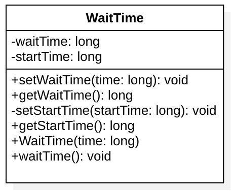
</p>

- waitTime: Attributo che rappresenta il tempo da aspettare (in millisecondi).
- startTime: Attributo che rappresenta il tempo iniziale trascorso.
- getWaitTime(): Metodo che serve per ottenere il tempo da aspettare.
- getStartTime(): Metodo che serve per ottenere il tempo iniziale.
- setWaitTime(): Metodo utile per impostare il tempo da aspettare.
- setStartTime(): Metodo utile per impostare il tempo iniziale.
- WaitTime(): Metodo costruttore, crea una nuova attesa definendo il tempo da aspettare.
- waitTime(): È il metodo principale che aspetta il tempo definito.
    ```java
    /**
     * Aspetta del tempo.
     */
    public void waitTime() {
        // Salva lo UNIX Time corrente in start time.
        this.setStartTime(System.currentTimeMillis());
        // Setta a false la variabile finished, la quale permette di uscire dal ciclo while.
        boolean finished = false;
        try {
            while (!finished) {
                // Finché non è finito eseguo il seguente codice:
                // somma lo UNIX Time salvato a quello da aspettare.
                long sum = this.getStartTime() + this.getWaitTime();
                // Compara la somma allo UNIX Time salvato.
                finished = sum >= System.currentTimeMillis();
                // Aspetta un centesimo del tempo da aspettare.
                Thread.sleep(this.getWaitTime() / 100);
            }
        } catch (InterruptedException ignored) {
        }
    }
    ```

<div class="page-break"></div>

### WaitTouchSensor

Classe utile per aspettare la pressione, il rilascio o il click di un sensore di tocco.

<p style="text-align:center;">

</p>

- WAIT_TIME: Costante che definisce l'intervallo di tempo tra un controllo e un altro della fine dell'attesa. Valore: 100 (millisecondi).
- PRESSED: Costante che definisce la pressione del sensore. Valore: 0.
- RELEASED: Costante che definisce il rilascio del sensore. Valore: 1.
- CLICKED: Costante che definisce il click (pressione e rilascio) del sensore. Valore: 2.
- touchSensor: Attributo che rappresenta il sensore di tocco.
- waitAction: Attributo che rappresenta l'azione da aspettare (premuto, rilasciato o cliccato).
- finished: Attributo interno che dice se l'attesa è finita.
- getTouchSensor(): Metodo che serve per ottenere il sensore di tocco.
- getWaitAction(): Metodo che serve per ottenere l'azione che si vuole aspettare.
- setTouchSensor(): Metodo utile per impostare il sensore di tocco.
- setWaitAction(): Metodo utile per impostare l'azione da aspettare.
- WaitTouchSensor(): Metodo costruttore, istanzia un nuovo `WaitTouchSensor` impostando l'azione (premuto, rilasciato, cliccato) e il sensore o la porta del brick in cui è inserito il sensore.
- isWaitAction(): Metodo utile per verificare che l'azione da aspettare imposta sia valida.
    ```java
    /**
     * Controlla se la wait aciton è valida.
     *
     * @param waitAction Wait action da controllare.
     * @return True se la wait action è valida, altrimenti false.
     */
    private boolean isWaitAction(byte waitAction) {
        // Controllo se l'azione passata è valida.
        if (waitAction == PRESSED || waitAction == RELEASED || waitAction == CLICKED) {
            return true;
        }
        return false;
    }
    ```
    <div class="page-break"></div>
- isPressedButton(): Metodo che dice se il sensore è premuto.
    ```java
    /**
     * Controlla se il bottone del sensore è premuto.
     *
     * @return True se il bottone del sensore è premuto.
     */
    public boolean isPressedButton() {
        // Se il sensore è premuto ritorna 'true'.
        return this.getTouchSensor().isPressed();
    }
    ```
- buttonPressedAction(): Metodo che aspetta la pressione del sensore.
    ```java
    /**
     * Aspetta che venga premuto il bottone del sensore.
     */
    protected void buttonPressedAction() throws InterruptedException {
        // Se non è premuto il sensore.
        if (!this.isPressedButton()) {
            // Aspetta che venga premuto.
            while (!this.isPressedButton()) {
                Thread.sleep(WAIT_TIME);
            }
            // Setta finished a true, perché il sensore è stato premuto.
            this.finished = true;
        }
    }
    ```
- buttonReleasedAction(): Metodo che aspetta il rilascio del sensore.
    ```java
    /**
     * Aspetta che venga rilasciato il bottone del sensore.
     */
    protected void buttonReleasedAction() throws InterruptedException {
        // Se il sensore è premuto.
        if (this.isPressedButton()) {
            // Aspetta che venga rilasciato.
            while (this.isPressedButton()) {
                Thread.sleep(WAIT_TIME);
            }
            // Setta finished a true, perché il sensore è stato rilasciato.
            this.finished = true;
        }
    }
    ```
- buttonClickedAction(): Metodo che aspetta il click (pressione e rilascio) del sensore.
    ```java
    /**
     * Aspetta che venga premuto (premuto e rilasciato) il bottone del sensore.
     */
    protected void buttonClickedAction() throws InterruptedException {
        // Aspetta che venga premuto il sensore.
        this.buttonPressedAction();
        // Aspetta che venga rilasciato il sensore.
        this.buttonReleasedAction();
    }
    ```
    <div class="page-break"></div>
- waitTouch(): È il metodo principale che termina l'attesa in base all'azione impostata.
    ```java
    /**
     * Metodo che fa aspettare l'evento sul bottone.
     */
    public void waitTouch() {
        // se non è finito
        while (!this.finished) {
            try {
                if (this.getWaitAction() == PRESSED) {
                    // se si aspetta che il bottone venga premuto
                    // aspetta che venga premuto
                    this.buttonPressedAction();
                } else if (this.getWaitAction() == RELEASED) {
                    // se si aspetta che il bottone venga rilasciato
                    // aspetta che venga rilasciato
                    this.buttonReleasedAction();
                } else if (this.getWaitAction() == CLICKED) {
                    // se si aspetta che il bottone venga cliccato
                    // aspetta che venga cliccato
                    this.buttonClickedAction();
                }
                // aspetta i millisecondi in WAIT_TIME
                Thread.sleep(WAIT_TIME);
            } catch (InterruptedException ignored) {
            }
        }
    }
    ```

<div class="page-break"></div>

### WaitUltrasonicSensor

Classe figlia di `WaitAnalogSensor` che aspetta che il sensore a ultrasuoni percepisca un certo valore.

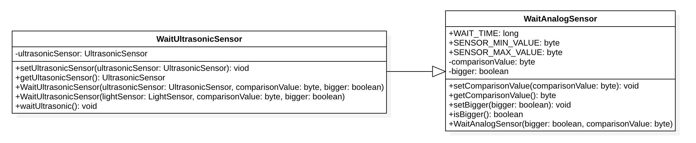

- ultrasonicSensor: Attributo che rappresenta il sensore a ultrasuoni.
- getUltrasonicSensor(): Metodo che serve per ottenere il sensore.
- setUltrasonicSensor(): Metodo utile per impostare il sensore.
- WaitUltrasonicSensor(): Metodo costruttore, istanzia un nuovo `WaitUltrasonicSensor` impostando il valore di confronto, se il valore letto deve essere maggiore di quello di confronto e il sensore o la porta del brick in cui è inserito il sensore.
- waitUltrasonic(): È il metodo principale che termina l'attesa in base al valore di confronto.
    ```java
    /**
     * Metodo che fa aspettare il valore giusto del sensore ad ultrasuoni.
     */
    public void waitUltrasonic() {
        // setta a false la variabile finished, la quale permette di uscire dal ciclo while
        boolean finished = false;
        while (!finished) {
            // finche non è finito eseguo il seguente codice
            try {
                if (this.isBigger()) {
                    // se deve essere maggiore confronto il valore del sensore ad
                    // ultrasuoni e quello di riferimento (comparisonValue) assegno
                    // a finished il risultato
                    finished = this.getUltrasonicSensor().getDistance() > this.getComparisonValue();
                } else {
                    // se deve essere minore confronto inversamente a prima i valori
                    finished = this.getUltrasonicSensor().getDistance() < this.getComparisonValue();
                }

                // aspettto i millisecondi in WAIT_TIME
                Thread.sleep(WAIT_TIME);
            } catch (InterruptedException ignored) {
            }
        }
    }
    ```

<div class="page-break"></div>

### SingleMotor

Classe utile per gestire un motore grande LEGO.

<p style="text-align:center;">
    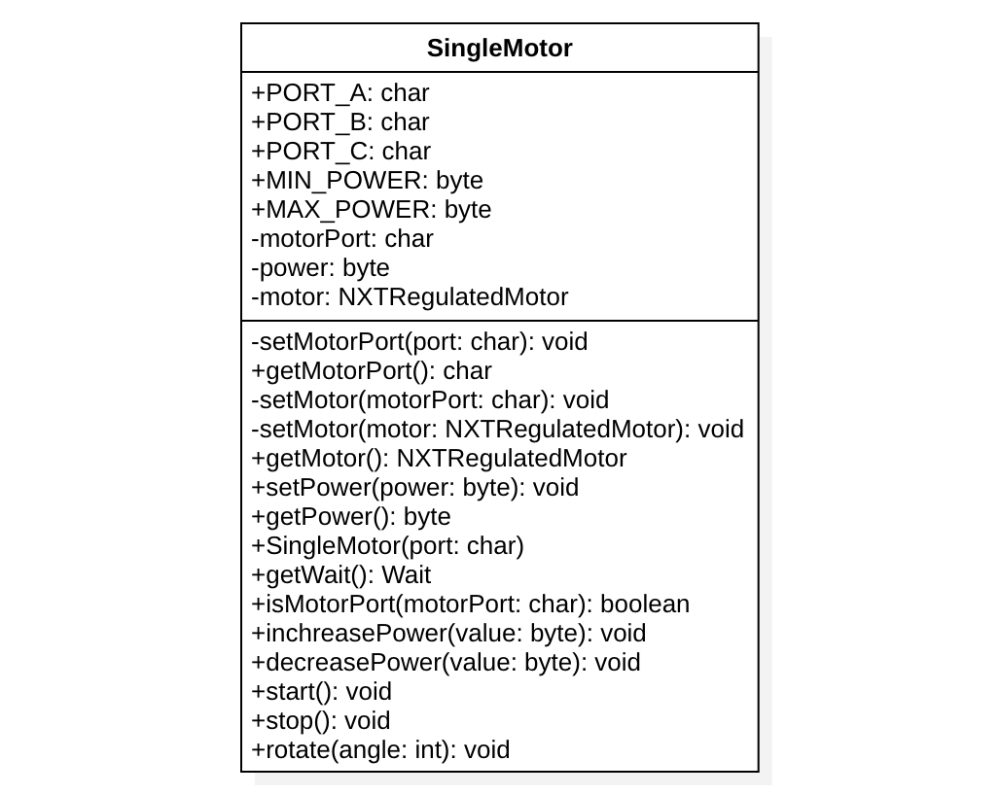
</p>

- PORT_A: Costante che definisce la porta `A` del brick. Valore: 'A'.
- PORT_B: Costante che definisce la porta `B` del brick. Valore: 'B'.
- PORT_C: Costante che definisce la porta `C` del brick. Valore: 'C'.
- MIN_POWER: Costante che definisce la potenza minima del motore. Valore: 0.
- MAX_POWER: Costante che definisce la potenza massima del motore. Valore: 100.
- motorPort: Attributo che rappresenta la porta dove è collegato il motore.
- motor: Attributo che rappresenta il motore.
- power: Attributo che rappresenta la potenza del motore.
- getMotorPort(): Metodo che serve per ottenere la porta in cui è collegato il motore.
- getMotor(): Metodo che serve per ottenere il motore.
- getPower(): Metodo che serve per ottenere la potenza del motore.
- setMotorPort(): Metodo utile per impostare la porta in cui è collegato il motore.
    ```java
    /**
     * Set the motor port on the NXT brick of the single motor.
     *
     * @param motorPort The port where the motor is connected.
     */
    private void setMotorPort(char motorPort) {
        // se la porta è valida
        if (this.isMotorPort(motorPort)) {
            // assegno la porta alla variabile
            this.motorPort = motorPort;
            // setto il motore su quella porta
            this.setMotor(this.motorPort);
        }
    }
    ```

<div class="page-break"></div>

- setMotor(): Metodo utile per impostare il motore, se non si passa il motore si può usare la porta in cui esso è collegato.
    ```java
    /**
     * Setta il motore connesso al brick.
     *
     * @param motor Motore connesso al brick.
     */
    private void setMotor(NXTRegulatedMotor motor) {
        // setto il motore
        this.motor = motor;
    }

    /**
     * Setta il motore connesso al brick.
     *
     * @param motorPort Porta dove è connesso il motore al brick.
     */
    private void setMotor(char motorPort) {
        // setto la porta del motore
        this.motorPort = motorPort;
        if (motorPort == PORT_A) {
            // se è la porta A assegno il motore A
            this.setMotor(Motor.A);
        } else if (motorPort == PORT_B) {
            // se è la porta B assegno il motore B
            this.setMotor(Motor.B);
        } else if (motorPort == PORT_C) {
            // se è la porta C assegno il motore C
            this.setMotor(Motor.C);
        }
    }
    ```
- setPower(): Metodo utile per impostare la potenza del motore.
    ```java
    /**
     * Setta la potenza del motore.
     *
     * @param power Potenza del motore.
     */
    public void setPower(byte power) {
        if (power > MAX_POWER) {
            // se la potenza è maggiore del massimo assegno il massimo
            power = MAX_POWER;
        } else if (power < MIN_POWER) {
            // se la potenza è minore del minimo assegno il minimo
            power = MIN_POWER;
        }
        // assegno la potenza all'attributo della classe
        this.power = power;
        // setto la potenza ai motori
        this.getMotor().setSpeed(this.getPower());
    }
    ```
- SingleMotor(): Metodo costruttore, si crea un nuovo `SingleMotor` definendo la porta in cui è collegato.
- isMotorPort(): Metodo utile per controllare che la porta usata sia valida (`A`, `B` o `C`).
    ```java
    /**
     * Controlla se la porta del motore passata come argomento è valida.
     *
     * @param motorPort Porta da controllare se è valida.
     * @return True se la porta del motore esiste, altrimenti false.
     */
    public boolean isMotorPort(char motorPort) {
        // controllo se la porta è valida
        if (motorPort == PORT_A || motorPort == PORT_B || motorPort == PORT_C) {
            return true;
        }
        return false;
    }
    ```
- increasePower(): Metodo utile per aumentare la potenza del motore.
    ```java
    /**
     * Aumenta la potenza del motore.
     *
     * @param value Valore di cui aumentare la potenza del motore.
     */
    public void increasePower(byte value) {
        // autmento la potenza del motore
        this.setPower((byte) (this.getPower() + value));
    }
    ```
- decreasePower(): Metodo utile per diminuire la potenza del motore.
    ```java
    /**
     * Decrementare la potenza del motore.
     *
     * @param value Valore di cui decrementare la potenza del motore.
     */
    public void decreasePower(byte value) {
        // decremento la potenza del motore
        this.setPower((byte) (this.getPower() - value));
    }
    ```
- start(): Metodo che serve per azionare il motore.
    ```java
    /**
     * Avviare il motore.
     */
    public void start() {
        // avvio il motore
        this.getMotor().forward();
        this.getMotor().setSpeed(this.getPower());
    }
    ```
- stop(): Metodo che ferma il motore.
    ```java
    /**
     * Fermare il motore.
     */
    public void stop() {
        // fermo il motore
        this.getMotor().stop();
    }
    ```
- rotate(): Metodo che ruota il motore dell'angolo passato.
    ```java
    /**
     * Ruotare il motore di un angolo.
     *
     * @param angle Angolo di cui ruotare il motore.
     */
    public void rotate(int angle) {
        // ruoto il motore di un certo angolo
        this.getMotor().rotate(angle);
    }
    ```

<div class="page-break"></div>

### Navigation

Classe che viene usata come base per muovere il brick tramite i due motori.

<p style="text-align:center;">
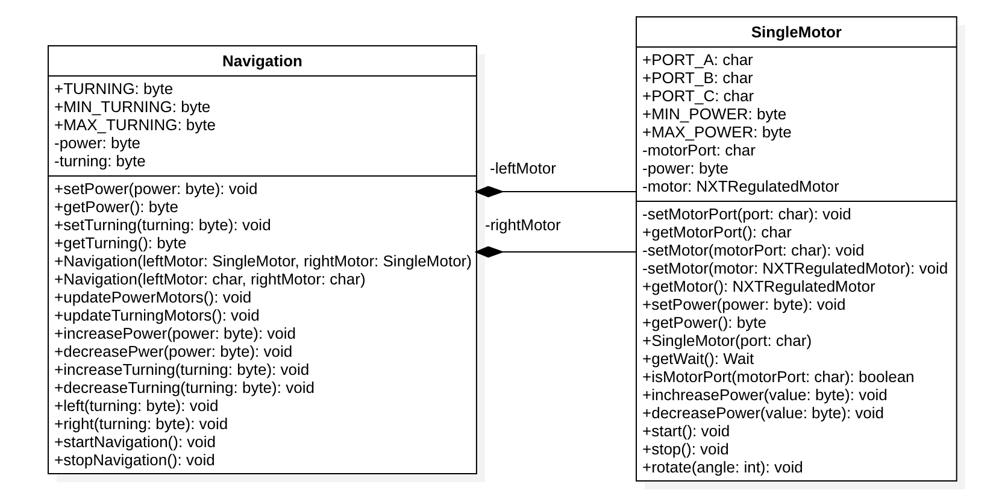
</p>

- TURNING: Costante che definisce il valore predefinito dello sterzo. Valore: 50.
- MIN_TURNING: Costante che definisce il valore minimo dello sterzo. Valore: `MIN_POWER` di `SingleMotor`.
- MAX_TURNING: Costante che definisce il valore massimo dello sterzo. Valore: `MAX_POWER` di `SingleMotor`.
- power: Attributo che rappresenta la potenza della navigazione.
- turning: Attributo che rappresenta lo sterzo della navigazione.
- leftMotor: Attributo che rappresenta il motore sinistro.
- rightMotor: Attributo che rappresenta il motore destro.
- getPower(): Metodo che serve per ottenere la potenza della navigazione.
- getTurning(): Metodo che serve per ottenere la potenza di svolta della navigazione.
- setPower(): Metodo utile per impostare la potenza della navigazione.
    ```java
    /**
     * Setta la potenza dei motori.
     * Controlla se il valore è valido.
     *
     * @param power Potenza dei motori.
     */
    public void setPower(byte power) {
        // La potenza non può essere maggiore di quella massima.
        if (power > SingleMotor.MAX_POWER) {
            power = SingleMotor.MAX_POWER;
        // La potenza non può essere minore di quella minima.
        } else if (power < SingleMotor.MIN_POWER) {
            power = SingleMotor.MIN_POWER;
        }
        // Imposto la potenza.
        this.power = power;
        // Aggiorno la potenza a entrambi i motori.
        this.updatePowerMotors();
    }
    ```
    <div class="page-break"></div>
- setTurning(): Metodo utile per impostare la potenza di svolta della navigazione.
    ```java
    /**
     * Setta lo sterzo della navigazione.
     * Lo sterzo toglie il valore dello sterzo ad un motore e lo aggiunge all'altro.
     *
     * @param turning Sterzo della navigazione.
     */
    public void setTurning(byte turning) {
        // Lo sterzo non può essere maggiore di quello massimo.
        if (turning > MAX_TURNING) {
            turning = MAX_TURNING;
        // Lo sterzo non può essere minore di quello minimo.
        } else if (turning < MIN_TURNING) {
            turning = MIN_TURNING;
        }
        // Imposto lo sterzo.
        this.turning = turning;
        // Aggiorno lo sterzo a entrambi i motori.
        this.updateTurningMotors();
    }
    ```
- Navigation(): Metodo costruttore, crea una nuova navigazione settando i motori direttamente oppure dalle porte in cui sono collegati.
- updatePowerMotors(): Metodo utile per aggiornare la potenza dei motori e di conseguenza lo sterzo.
    ```java
    /**
     * Aggiorna lo stato dei motori.
     * Aggiorna la potenza del motore sinistro e destro, e infine aggiorna lo sterzo.
     */
    private void updatePowerMotors() {
        // Imposto la potenza al motore sinistro.
        this.leftMotor.setPower(this.getPower());
        // Imposto la potenza al motore destro.
        this.rightMotor.setPower(this.getPower());
        // Aggiorno lo sterzo.
        this.updateTurningMotors();
    }
    ```
- updateTurningMotors: Metodo utile per aggiornare lo sterzo dei motori.
    ```java
    /**
     * Aggiorna lo sterzo dei motori.
     */
    private void updateTurningMotors() {
        // Giro a sinistra.
        if (this.getTurning() > 0) {
            this.leftMotor.decreasePower(this.getTurning());
            this.rightMotor.increasePower(this.getTurning());
        // Giro a destra.
        } else {
            this.leftMotor.increasePower((byte) - this.getTurning());
            this.rightMotor.decreasePower((byte) - this.getTurning());
        }
    }
    ```
- increasePower(): Metodo che serve per aumentare la potenza della navigazione.
    ```java
    /**
     * Incrementa la potenza della navigazione.
     *
     * @param value Valore di cui incrementare la potenza della naviagazione.
     */
    public void increasePower(byte value) {
        // Imposto la potenza aumentandola di 'value'.
        this.setPower((byte) (this.getPower() + value));
    }
    ```
- decreasePower(): Metodo che serve per diminuire la potenza della navigazione.
    ```java
    /**
     * Decrementare la potenza della naviagazione.
     *
     * @param value Value di cui decrementare la potenza della navigazione.
     */
    public void decreasePower(byte value) {
        // Imposto la potenza diminuendola di 'value'.
        this.setPower((byte) (this.getPower() - value));
    }
    ```
- increaseTurning(): Metodo che serve per aumentare la potenza di svolta della navigazione.
    ```java
    /**
     * Incrementare lo sterzo della navigazione.
     *
     * @param value Valore di cui incrementare lo sterzo.
     */
    public void increaseTurning(byte value) {
        // Imposto lo sterzo aumentandolo di 'value'.
        this.setTurning((byte) (this.getTurning() + value));
    }
    ```
- decreaseTurning(): Metodo che serve per diminuire la potenza di svolta della navigazione.
    ```java
    /**
     * Decrementare lo sterzo della navigazione.
     *
     * @param value Valore di cui decrementare lo sterzo della navigazione.
     */
    public void decreaseTurning(byte value) {
        // Imposto lo sterzo diminuendolo di 'value'.
        this.setTurning((byte) (this.getTurning() - value));
    }
    ```
- left(): Metodo che permette di girare a sinistra di una certa intensità.
    ```java
    /**
     * Gira a sinistra.
     *
     * @param turning Sterzo verso sinistra.
     */
    public void left(byte turning) {
        this.decreaseTurning(turning);
    }
    ```
- right(): Metodo che permette di girare a destra di una certa intensità.
    ```java
    /**
     * Gira a destra.
     *
     * @param turning Sterzo verso destra.
     */
    public void right(byte turning) {
        this.increaseTurning(turning);
    }
    ```
    <div class="page-break"></div>
- start(): Metodo che fa partire la navigazione azionando i motori.
    ```java
    /**
     * Avvia i motori.
     */
    public void start() {
        // Imposto la potenza al massimo.
        this.setPower(SingleMotor.MAX_POWER);
        // Avvio i motori.
        this.leftMotor.start();
        this.rightMotor.start();
    }
    ```
- stop(): Metodo che ferma la navigazione arrestando i motori.
    ```java
    /**
     * Ferma i motori.
     */
    public void stop() {
        // Fermo i motori.
        this.leftMotor.stop();
        this.rightMotor.stop();
    }
    ```

<div class="page-break"></div>

### LineFollower

Classe figlia di `Navigation` che usa due motori e un sensore di luce per seguire una linea.

<p>
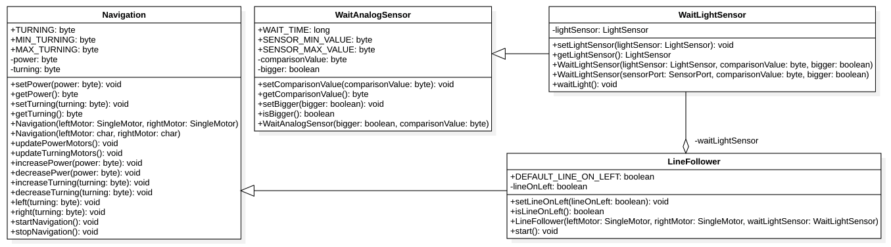
</p>

- DEFAULT_LINE_ON_LEFT: Costante che definisce il valore predefinito per la posizione della linea rispetto al robot (destra o sinistra). Valore: true.
- waitLightSensor: Attributo interno che rappresenta l'attesa del sensore di luce.
- lineOnLeft: Attributo che rappresenta la posizione della linea rispetto al robot (come riferimento la sinistra).
- isLineOnLeft(): Metodo che serve per sapere la posizione della linea.
- setLineOnLeft(): Metodo utile per impostare la posizione della linea.
- LineFollower(): Metodo costruttore, crea un nuovo `LineFollower` definendo motore destro e sinistro e l'attesa del sensore di luce.
- start(): È il metodo principale che unisce la navigazione dei motori con l'attesa del sensore così da seguire la linea.
    ```java
    /**
     * Avvio del line follower.
     */
    public void start() {
        // Sensore di luce.
        WaitLightSensor wait = this.waitLightSensor;
        // Setto il valore di confronto a 50 (metà).
        wait.setComparisonValue((byte) 50);
        // Il valore del sensore deve essere maggiore
        // a dipendenza della posizione della linea.
        wait.setBigger(this.isLineOnLeft());
        // Avvio della navigazione.
        super.start();
        while (true) {
            // Attesa della luce riflessa.
            wait.waitLight();
            // Svolta a destra o sinistra.
            if (this.isLineOnLeft()) {
                this.right(TURNING);
            } else {
                this.left(TURNING);
            }
            // Attesa della luce opposta.
            wait.setBigger(!wait.isBigger());
            wait.waitLight();
            // Svolta a destra o sinistra.
            if (this.isLineOnLeft()) {
                this.left(TURNING);
            } else {
                this.right(TURNING);
            }
            // Inverto ancora la direzione.
            wait.setBigger(!wait.isBigger());
        }
    }
    ```

### ProportionalLineFollower

Classe figlia di `Navigation` che usa due motori e due sensori di luce per seguire una linea in maniera proporzionale.

<p>
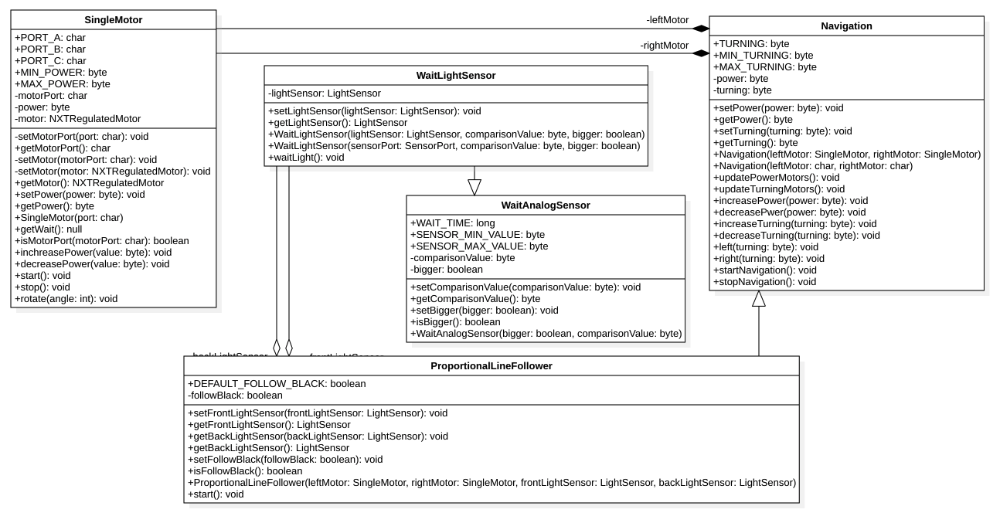
</p>

- DEFAULT_FOLLOW_BLACK: Costante che definisce il colore della linea da seguire (nera o bianca). Valore: true.
- frontLightSensor: Attributo che rappresenta Il sensore di luce frontale.
- backLightSensor: Attributo che rappresenta Il sensore di luce posteriore.
- followBlack: Attributo che rappresenta il colore della linea da seguire (come riferimento la linea nera).
- getFrontLightSensor(): Metodo che serve per ottenere il sensore di luce frontale.
- getBackLightSensor(): Metodo che serve per ottenere il sensore di luce posteriore.
- isOnBlack(): Metodo che serve per sapere il colore della linea.
- setFrontLightSensor(): Metodo utile per impostare il sensore di luce frontale.
- setBackLightSensor(): Metodo utile per impostare il sensore di luce posteriore.
- setFollowBlack(): Metodo utile per impostare il colore della linea.
- ProportionalLineFollower(): Metodo costruttore, crea un nuovo `ProportionalLineFollower` definendo
motore destro e sinistro e i due sensori di luce.
<div class="page-break"></div>

- start(): È il metodo principale che unisce la navigazione dei motori con i due sensori così da seguire la linea in modo proporzionale, quindi senza avere il riferimento della posizione della linea rispetto al robot.
    ```java
    /**
     * Avviare il line follower proporzionale.
     */
    public void start() {
        // Avvio della navigazione.
        super.start();
        while (true) {
            if (this.getFrontLightSensor().getLightValue() < 50) {
                // se il sensore di luce anteriore legge un valore minore di 50 salva il valore
                // nella variabile value
                byte value = (byte) this.getFrontLightSensor().getLightValue();
                // sottrai a value la potenza dei motori
                value -= this.getPower();
                // dividi value per 1.5
                value /= 1.5;
                // setta value allo sterzo della navigazione
                this.setTurning(value);
            } else {
                // altrimenti
                if (this.getBackLightSensor().getLightValue() < 50) {
                    // se il sensore di luce posteriore legge un valore minore di 50 salva il Valore
                    // nella variabile value
                    byte value = (byte) this.getBackLightSensor().getLightValue();
                    // sottrai a value la potenza dei motori
                    value -= this.getPower();
                    // dividi value per 1.5
                    value /= 1.5;
                    // setta il valore di value allo sterzo della navigazione
                    this.setTurning(value);
                } else {
                    // altrimenti vai dritto
                    this.setTurning((byte) 0);
                }
            }
        }
    }
    ```

<div class="page-break"></div>

## Test

### Protocollo di test

|Test Case      | TC-001                               |
|---------------|--------------------------------------|
|**Nome**       |Verificare il funzionamento di leJOS su NXT e produrre una guida|
|**Riferimento**|REQ-01                               |
|**Descrizione**|Installare il firmware sul brick NXT che si vuole utilizzare e caricarci un programma Java verificando il funzionamento e fare una guida della procedura|
|**Prerequisiti**|Avere Java installato sulla macchina e scrivere un semplice programma di test |
|**Procedura**     | <ul><li>Installare il driver USB per collegare il NXT </li><li>Installare e configurare leJOS</li><li>Scrivere un programma di test, ad esempio <code>HelloWorld</code></li><li>Produrre una guida di tutto il procedimento</li></ul> |
|**Risultati attesi** |Il computer identifica il brick NXT e si riesce a caricare ed eseguire un programma Java e la guida è stata fatta (<code>usareLegoLib</code>)|

|Test Case      | TC-002                               |
|---------------|--------------------------------------|
|**Nome**       |Controllare i sensori: TouchSensor |
|**Riferimento**|REQ-02                               |
|**Descrizione**|Controllare che il sensore di tocco funzioni correttamente con leJOS |
|**Prerequisiti**|Aver installato il firmware leJOS sul brick NXT |
|**Procedura**     | <ul><li>Collegare il sensore di touch alla porta 1 del brick NXT</li><li>Caricare sul brick il programma <code>TestTouchSensor</code></li><li>Eseguire il programma</li></ul>|
|**Risultati attesi** |Quando il touch sensor &egrave; premuto dovrebbe ritornare <b>true</b>, mentre quando non lo &egrave; dovrebbe ritornare <b>false</b>. |

<div class="page-break"></div>

|Test Case      | TC-003                               |
|---------------|--------------------------------------|
|**Nome**       |Controllare i sensori: NxtButton |
|**Riferimento**|REQ-02                               |
|**Descrizione**|Controllare che i pulsanti del brick NXT funzionino correttamente con leJOS |
|**Prerequisiti**|Aver installato il firmware leJOS sul brick NXT |
|**Procedura**     | <ul><li>Eseguire il programma <code>TestNxtButton</code> sul brick NXT</li><li>Cliccare i pulsanti seguendo l'ordine:<ol><li>Tasto destro</li><li>Tasto enter</li><li>Tasto sinistro</li><li>Tasto escape</li></ol></li></ul>|
|**Risultati attesi** |Quando viene premuto un pulsante viene scritto nella rispettiva colonna nello schermo LCD "down", altrimenti "up". |

|Test Case      | TC-004                               |
|---------------|--------------------------------------|
|**Nome**       |Controllare i sensori: UltrasonicSensor |
|**Riferimento**|REQ-02                               |
|**Descrizione**|Controllare che il sensore a ultrasuoni funzioni correttamente con leJOS |
|**Prerequisiti**|Aver installato il firmware leJOS sul brick NXT |
|**Procedura**     | <ul><li>Collegare il sensore a ultrasuoni sensor alla porta 1 del brick NXT</li><li>Caricare sul brick il programma <code>TestUltrasonicSensor</code></li><li>Eseguire il programma</li><li>Mettere il sensore in direzione di una parete</li><li>Avvicinare ed allontanare il sensore alla parete</li></ul>|
|**Risultati attesi** |Quando il sensore si avvicina alla parete il numero sul display deve diminuire, mentre quando si allontana il valore deve aumentare |

<div class="page-break"></div>

|Test Case      | TC-005                               |
|---------------|--------------------------------------|
|**Nome**       |Controllare i sensori: LightSensor |
|**Riferimento**|REQ-02                               |
|**Descrizione**|Controllare che il sensore di luce funzioni correttamente con leJOS |
|**Prerequisiti**|Aver installato il firmware leJOS sul brick NXT |
|**Procedura**     | <ul><li>Collegare il sensore di luce alla porta 1 del brick NXT</li><li>Caricare sul brick il programma <code>TestLightSensor</code></li><li>Eseguire il programma</li><li>Posizionare il sensore di luce su una superficie scura</li><li>spostare il sensore di luce su una superficie chiara</li></ul>|
|**Risultati attesi** |Quando il sensore di luce &egrave; sulla superficie chiara il valore deve essere alto, mentre quando il sensore di luce &egrave; su una superficie scura il valore deve essere basso |

|Test Case      | TC-006                               |
|---------------|--------------------------------------|
|**Nome**       |Controllare i sensori: SoundSensor |
|**Riferimento**|REQ-02                               |
|**Descrizione**|Controllare che il sensore di suono funzioni correttamente con leJOS |
|**Prerequisiti**|Aver installato il firmware leJOS sul brick NXT |
|**Procedura**     | <ul><li>Collegare il sensore di suono alla porta 1 del brick NXT</li><li>Caricare sul brick il programma <code>TestSoundSensor</code></li><li>Eseguire il programma</li><li>Mettere il sensore in un luogo silenzioso</li><li>spostare il sensore in un luogo con più rumore</li></ul>|
|**Risultati attesi** |Quando il sensore di suono &egrave; in un luogo silenzioso il valore deve essere basso, mentre nel luogo più rumoroso il valore deve essere piu alto. |

|Test Case      | TC-007                               |
|---------------|--------------------------------------|
|**Nome**       |Controllare i motori |
|**Riferimento**|REQ-02                               |
|**Descrizione**|Controllare che il motore funzioni correttamente con leJOS |
|**Prerequisiti**|Aver installato il firmware leJOS sul brick NXT |
|**Procedura**     | <ul><li>Collegare il sensore di touch alla porta A del brick NXT</li><li>Caricare sul brick il programma <code>TestMotor</code></li><li>Eseguire il programma</li></ul>|
|**Risultati attesi** |Il motore dovrebbe fare due rotazioni |

<div class="page-break"></div>

|Test Case      | TC-008                               |
|---------------|--------------------------------------|
|**Nome**       |Calibrazione LightSensor |
|**Riferimento**|REQ-03                               |
|**Descrizione**|Creare una classe che sia in grado di calibrare il sensore di luce |
|**Prerequisiti**|Aver installato il firmware leJOS sul brick NXT |
|**Procedura**     | <ul><li>Collegare il sensore di luce alla porta 1 del brick NXT</li><li>Caricare sul brick il programma <code>LightSensorCalibrator</code></li><li>Eseguire il programma</li><li>Calibrazione del bianco</li><li>Calibrazione del nero</li></ul>|
|**Risultati attesi** |Dopo la calibrazione, il sensore avrà come punto 0 la calibrazione del nero e come punto 100 la calibrazione del bianco. |

|Test Case      | TC-009                               |
|---------------|--------------------------------------|
|**Nome**       |WaitLightSensor |
|**Riferimento**|REQ-03                               |
|**Descrizione**|Creare una classe che aspetti un certo valore dal sensore di luce |
|**Prerequisiti**|Aver installato il firmware leJOS sul brick NXT |
|**Procedura**     | <ul><li>Collegare il sensore di luce sulla porta 1 del brick NXT</li><li>Caricare sul brick il programma <code>UseWaitLightSensor</code></li><li>Eseguire il programma</li><li>Attesa di una luce chiara</li><li>Attesa di una luce scura</li></ul>|
|**Risultati attesi** |Il test identifica correttamente la luce chiara e successivamente la luce scura. |

|Test Case      | TC-010                               |
|---------------|--------------------------------------|
|**Nome**       |WaitTouchSensor |
|**Riferimento**|REQ-03                               |
|**Descrizione**|Creare una classe che aspetti la pressione o il rilascio o il click (pressione e rilascio) di un sensore di tocco |
|**Prerequisiti**|Aver installato il firmware leJOS sul brick NXT |
|**Procedura**     | <ul><li>Collegare il sensore di tocco sulla porta 1 del brick NXT</li><li>Caricare sul brick il programma <code>UseWaitTouchSensor</code></li><li>Eseguire il programma</li><li>Attesa del click del sensore</li></ul>|
|**Risultati attesi** |Il test identifica correttamente il click del sensore. |

<div class="page-break"></div>

|Test Case      | TC-011                               |
|---------------|--------------------------------------|
|**Nome**       |WaitUltrasonicSensor |
|**Riferimento**|REQ-03                               |
|**Descrizione**|Creare una classe che aspetti una certa distanza dal sensore a ultrasuoni |
|**Prerequisiti**|Aver installato il firmware leJOS sul brick NXT |
|**Procedura**     | <ul><li>Collegare il sensore a ultrasuoni sulla porta 1 del brick NXT</li><li>Caricare sul brick il programma <code>UseWaitUltrasonicSensor</code></li><li>Eseguire il programma</li><li>Attesa di una distanza maggiore a 50cm</li><li>Attesa di una distanza minore a 50cm</li></ul>|
|**Risultati attesi** |Il test identifica correttamente le distanze. |

|Test Case      | TC-012                               |
|---------------|--------------------------------------|
|**Nome**       |WaitSoundSensor |
|**Riferimento**|REQ-03                               |
|**Descrizione**|Creare una classe che aspetti una certa intensità di rumore percepita dal microfono |
|**Prerequisiti**|Aver installato il firmware leJOS sul brick NXT |
|**Procedura**     | <ul><li>Collegare il microfono sulla porta 1 del brick NXT</li><li>Caricare sul brick il programma <code>UseWaitSoundSensor</code></li><li>Eseguire il programma</li><li>Attesa di un suono forte</li><li>Attesa di un suono debole (silenzio)</li></ul>|
|Risultati attesi|Il test identifica correttamente le intensità di rumore.|

<div class="page-break"></div>

|Test Case      | TC-013                               |
|---------------|--------------------------------------|
|**Nome**       |WaitNxtButton |
|**Riferimento**|REQ-03                               |
|**Descrizione**|Creare una classe che aspetti un certo pulsante di quelli presenti sul brick NXT |
|**Prerequisiti**|Aver installato il firmware leJOS sul brick NXT |
|**Procedura**     | <ul><li>Caricare sul brick il programma <code>UseWaitNxtButton</code></li><li>Eseguire il programma</li><li>Attesa del pulsante sinistro</li><li>Attesa del pulsante enter</li><li>Attesa del pulsante destro</li><li>Attesa del pulsante indietro</li></ul>|
|**Risultati attesi** |Il test identifica correttamente i pulsanti e non succede niente se si premono quelli non interessati|

|Test Case      | TC-014                               |
|---------------|--------------------------------------|
|**Nome**       |WaitMotor |
|**Riferimento**|REQ-03                               |
|**Descrizione**|Creare una classe che aspetti un certo numero di rotazioni da parte di un motore |
|**Prerequisiti**|Aver installato il firmware leJOS sul brick NXT |
|**Procedura**     | <ul><li>Collegare il motore sulla porta A del brick NXT</li><li>Caricare sul brick il programma <code>UseWaitMotor</code></li><li>Eseguire il programma</li><li>Attendere 3 rotazioni del motore</li></ul>|
|**Risultati attesi** |Il test identifica correttamente le tre rotazioni e poi si ferma |

|Test Case      | TC-015                               |
|---------------|--------------------------------------|
|**Nome**       |WaitTime |
|**Riferimento**|REQ-03                               |
|**Descrizione**|Creare una classe che aspetti il tempo definito |
|**Prerequisiti**|Aver installato il firmware leJOS sul brick NXT |
|**Procedura**     | <ul><li>Caricare sul brick il programma <code>UseWaitTime</code></li><li>Eseguire il programma</li><li>Attendere 5 secondi</li></ul>|
|**Risultati attesi** |Il test aspetta 5 secondi e poi finisce |

<div class="page-break"></div>

|Test Case      | TC-016                               |
|---------------|--------------------------------------|
|**Nome**       |Navigation |
|**Riferimento**|REQ-04                               |
|**Descrizione**|Creare una classe che permetta di controllare la navigazione a due motori del robot |
|**Prerequisiti**|Aver installato il firmware leJOS sul brick NXT |
|**Procedura**     | <ul><li>Caricare sul brick il programma <code>UseNavigation</code></li><li>Eseguire il programma</li><li>Attendere che il programma di test esegua i metodi per testarli</li></ul>|
|**Risultati attesi** |I metodi funzionano correttamente e permettono di guidare un robot |

|Test Case      | TC-017                               |
|---------------|--------------------------------------|
|**Nome**       |ProportionalLineFollower |
|**Riferimento**|REQ-05                               |
|**Descrizione**|Creare una classe che permetta a un robot di seguire una linea in maniera proporzionale |
|**Prerequisiti**|Aver installato il firmware leJOS sul brick NXT |
|**Procedura**     | <ul><li>Caricare sul brick il programma <code>PLFRunner</code></li><li>Eseguire il programma dopo aver messo il robot su una linea</li></ul>|
|**Risultati attesi** |Il robot segue la linea correttamente |

<div class="page-break"></div>

### Risultati test

<table>
    <tr>
        <th style="min-width:48px">Test Case</th>
        <th style="text-align:center;">Risultato</th>
        <th>Note</th>
    </tr>
    <tr>
        <td>TC-001</td>
        <td style="color:green!important;text-align:center;">OK</td>
        <td>Il brick &egrave; stato configurato correttamente e il programma viene eseguito producendo l'output voluto (Il test &egrave; spiegato in questa documentazione). Inoltre &egrave; anche presente la guida dell'installazione e dell'utilizzo del prodotto (usareLegoLib).</td>
    </tr>
</table>

| Test Case | Risultato  |
| --------- | ---------- |
| TC-001    | <p style="color:lime;">Il brick &egrave; stato configurato correttamente e il programma viene eseguito producendo l'output voluto (Il test &egrave; spiegato in questa documentazione). Inoltre &egrave; anche presente la guida dell'installazione e dell'utilizzo del prodotto (usareLegoLib).</p> |
| TC-002    | <p style="color:lime;">Il programma ritorna true e false correttamente in base al sensore di tocco se &egrave; premuto o meno.</p> |
| TC-003    | <p style="color:lime;">Il programma mostra correttamente quale pulsante viene premuto.</p> |
| TC-004    | <p style="color:lime;">Il numero sul display mostra correttamente la distanza tra il sensore e la superficie a cui si punta.</p> |
| TC-005    | <p style="color:lime;">Il numero &egrave; alto se la superficie &egrave; chiara, mentre &egrave; pi&ugrave; basso se la superficie &egrave; scura.</p> |
| TC-006    | <p style="color:lime;">Il valore &egrave; alto se si fa un suono vicino al microfono, mentre se si fa silenzio il valore &egrave; basso.</p> |
| TC-007    | <p style="color:lime;">Il motore fa correttamente due rotazioni.</p> |
| TC-008    | <p style="color:lime;">I valori del sensore di luce vengono impostati correttamente.</p> |
| TC-009    | <p style="color:lime;">All'inizio il sensore viene messo su una luce scura, poi quando va nella luce chiara da risultato positivo. Poi si mette su una luce scura e da risultato positivo.</p> |
| TC-010    | <p style="color:lime;">Il test termina solo quando il sensore viene premuto e rilasciato (click).</p> |
| TC-011    | <p style="color:red;">Il sensore a ultrasuoni non identifica una distanza maggiore di 50cm.</p> |
| TC-012    | <p style="color:lime;">Il microfono percepisce correttamente prima un suono forte e poi il silenzio.</p> |
| TC-013    | <p style="color:lime;">Il test continua solo se viene premuto il pulsante interessato.</p> |
| TC-014    | <p style="color:red;">Il motore non si ferma dopo le tre rotazioni</p> |
| TC-015    | <p style="color:red;">L'attesa non dura 5 secondi ma finisce subito.</p> |
| TC-016    | <p style="color:lime;">La navigazione esegue i metodi impostati correttamente.</p> |
| TC-017    | <p style="color:red;">Il robot non segue la linea correttamente.</p> |

<div class="page-break"></div>

<br><br><br><br><br><br><br><br><br>
<div style="-webkit-transform: rotate(90deg);-moz-transform: rotate(90deg);-o-transform: rotate(90deg);-ms-transform: rotate(90deg);transform: rotate(90deg);width:650px;">
    <p>&nbsp;<br></p>
    <h2>Consuntivo</h2>
    <p>Rispetto alla pianificazione iniziale sono cambiate molte cose: ci sono stati capitoli che sono durati meno del previsto e altri che hanno occupato molto più tempo di quanto pianificato. Inoltre è stato necessario lavorare a casa per recuperare il tempo perso quando si riscontravano dei problemi durante la progettazione e l'implementazione.  
Questo è il diagramma di Gantt definitivo che mostra come abbiamo usato il nostro tempo durante lo sviluppo del progetto:</p>
    
</div>

<div class="page-break"></div>

## Conclusioni

La soluzione implementata permette di creare pi&ugrave; agevolmente dei programmi complessi,
permettera di concentrarsi maggiormente sulla risoluzione dei problemi delle gare di robotica che
sui problemi legati alla comunicazione con i sensori.

### Sviluppi futuri

Il prodotto ha molti punti da migliorare, ma anche molte cose su cui si può lavorare per renderlo
più completo. Nel caso in cui leJOS fornisse una JMV migliore che supporta la programmazione
concorrenziale, si potrebbe riprendere l'idea delle classi Wait asincrone, le quali permetterebbero
di sviluppare programmi molto pi&ugrave; complessi.

La libreria sviluppata in questo progetto può comunque essere usata come base per progetti molto
complicati, come la WRO, riuscendo a focalizzare le proprie energie sui problemi della gara.

### Considerazioni personali
Durante la realizzazione del progetto sono state imparate varie tecninche di lavoro e come comportarsi quando si lavora in coppia. La gestione del repository sul sistema di versioning è andata bene ed è stata utile, perché si poteva sempre sapere chi stava lavorando su cosa e le modifiche venivano condivise in modo facile e veloce. Tuttavia, bisogna dire che i committenti non sono stati molto chiari con la specifica dei requisiti e ci è voluto troppo tempo per capire cosa bisognasse effettivamente sviluppare.

### Sitografia

- http://www.lejos.org/nxt/nxj/tutorial/Preliminaries/FirstProgram.htm, 19-12-2018
- http://www.lejos.org/nxt/nxj/api/index.html
- http://www.lejos.org/nxt/nxj/tutorial/MotorTutorial/ControllingMotors.htm
- http://www.lejos.org/nxt/nxj/tutorial/LCD_Sensors/LCD_Sensors.htm
- http://stackoverflow.com

## Allegati

Elenco degli allegati, esempio:

-   Diari di lavoro

-   Codici sorgente/documentazione macchine virtuali

-   Istruzioni di installazione del prodotto (con credenziali
    di accesso) e/o di eventuali prodotti terzi

-   Documentazione di prodotti di terzi

-   Eventuali guide utente / Manuali di utilizzo

-   Mandato e/o Qdc

-   Prodotto

-   …
