<style>
.clearfix::after {
  content: "";
  clear: both;
  display: table;
}

.index {
    width:100%;
}

.index .capitle {
    width: 100px;
    float:l eft;
}

.index .page {
    width: 50px;
    float: left;
    text-align: center;
}
</style>

# **Usare lego-lib**

## Indice

<div class="clearfix index">
    <div class="capitle" style="width:80%;float:left;border-bottom:1px dotted #DDDDDD;"><h5>Capitolo</h5></div>
    <div class="page" style="text-align:right;width:20%;float:left;border-bottom:1px dotted #DDDDDD;"><h5>Pagina</h5></div>
    <div style="margin-top:5px;widht:100%;"> </div>
    <div class="capitle" style="width:80%;float:left;border-bottom:1px dotted #DDDDDD;">Introduzione</div>
    <div class="page" style="text-align:right;width:20%;float:left;border-bottom:1px dotted #DDDDDD;">2</div>
    <div class="capitle" style="width:80%;float:left;border-bottom:1px dotted #DDDDDD;">Installazione</div>
    <div class="page" style="text-align:right;width:20%;float:left;border-bottom:1px dotted #DDDDDD;">2</div>
        <div class="capitle" style="width:80%;float:left;border-bottom:1px dotted #DDDDDD;">&emsp;Java</div>
        <div class="page" style="text-align:right;width:20%;float:left;border-bottom:1px dotted #DDDDDD;">2</div>
            <div class="capitle" style="width:80%;float:left;border-bottom:1px dotted #DDDDDD;">
                &emsp;&emsp;Java Runtime Environment
            </div>
            <div class="page" style="text-align:right;width:20%;float:left;border-bottom:1px dotted #DDDDDD;">2</div>
            <div class="capitle" style="width:80%;float:left;border-bottom:1px dotted #DDDDDD;">
                &emsp;&emsp;Java Development Kit
            </div>
            <div class="page" style="text-align:right;width:20%;float:left;border-bottom:1px dotted #DDDDDD;">3</div>
            <div class="capitle" style="width:80%;float:left;border-bottom:1px dotted #DDDDDD;">
                &emsp;&emsp;Variabili d'ambiente
            </div>
            <div class="page" style="text-align:right;width:20%;float:left;border-bottom:1px dotted #DDDDDD;">3</div>
        <div class="capitle" style="width:80%;float:left;border-bottom:1px dotted #DDDDDD;">
            &emsp;Driver USB
        </div>
        <div class="page" style="text-align:right;width:20%;float:left;border-bottom:1px dotted #DDDDDD;">4</div>
        <div class="capitle" style="width:80%;float:left;border-bottom:1px dotted #DDDDDD;">
            &emsp;leJOS
        </div>
        <div class="page" style="text-align:right;width:20%;float:left;border-bottom:1px dotted #DDDDDD;">5</div>
            <div class="capitle" style="width:80%;float:left;border-bottom:1px dotted #DDDDDD;">
                &emsp;&emsp;Intallazione
            </div>
            <div class="page" style="text-align:right;width:20%;float:left;border-bottom:1px dotted #DDDDDD;">5</div>
            <div class="capitle" style="width:80%;float:left;border-bottom:1px dotted #DDDDDD;">
                &emsp;&emsp;Configurazione
            </div>
            <div class="page" style="text-align:right;width:20%;float:left;border-bottom:1px dotted #DDDDDD;">5</div>
            <div class="capitle" style="width:80%;float:left;border-bottom:1px dotted #DDDDDD;">
                &emsp;&emsp;Utilizzo
            </div>
            <div class="page" style="text-align:right;width:20%;float:left;border-bottom:1px dotted #DDDDDD;">5</div>
            <div class="capitle" style="width:80%;float:left;border-bottom:1px dotted #DDDDDD;">
                &emsp;&emsp;HelloWorld
            </div>
            <div class="page" style="text-align:right;width:20%;float:left;border-bottom:1px dotted #DDDDDD;">5</div>
            <div class="capitle" style="width:80%;float:left;border-bottom:1px dotted #DDDDDD;">
                &emsp;&emsp;Compilazione e avvio
            </div>
            <div class="page" style="text-align:right;width:20%;float:left;border-bottom:1px dotted #DDDDDD;">6</div>
            <div class="capitle" style="width:80%;float:left;border-bottom:1px dotted #DDDDDD;">
                &emsp;&emsp;lego-lib &amp; IDE
            </div>
            <div class="page" style="text-align:right;width:20%;float:left;border-bottom:1px dotted #DDDDDD;">6</div>
    <div class="capitle" style="width:80%;float:left;border-bottom:1px dotted #DDDDDD;">
        Struttura
    </div>
    <div class="page" style="text-align:right;width:20%;float:left;border-bottom:1px dotted #DDDDDD;">7</div>
        <div class="capitle" style="width:80%;float:left;border-bottom:1px dotted #DDDDDD;">
            &emsp;Blocchi arancioni
        </div>
        <div class="page" style="text-align:right;width:20%;float:left;border-bottom:1px dotted #DDDDDD;">7</div>
        <div class="capitle" style="width:80%;float:left;border-bottom:1px dotted #DDDDDD;">
            &emsp;Wait
        </div>
        <div class="page" style="text-align:right;width:20%;float:left;border-bottom:1px dotted #DDDDDD;">7</div>
            <div class="capitle" style="width:80%;float:left;border-bottom:1px dotted #DDDDDD;">
                &emsp;&emsp;Sensori analogici
            </div>
            <div class="page" style="text-align:right;width:20%;float:left;border-bottom:1px dotted #DDDDDD;">7</div>
            <div class="capitle" style="width:80%;float:left;border-bottom:1px dotted #DDDDDD;">
                &emsp;&emsp;Wait Time
            </div>
            <div class="page" style="text-align:right;width:20%;float:left;border-bottom:1px dotted #DDDDDD;">8</div>
            <div class="capitle" style="width:80%;float:left;border-bottom:1px dotted #DDDDDD;">
                &emsp;&emsp;Wait Motor
            </div>
            <div class="page" style="text-align:right;width:20%;float:left;border-bottom:1px dotted #DDDDDD;">10</div>
            <div class="capitle" style="width:80%;float:left;border-bottom:1px dotted #DDDDDD;">
                &emsp;&emsp;Wait Touch Sensor
            </div>
            <div class="page" style="text-align:right;width:20%;float:left;border-bottom:1px dotted #DDDDDD;">11</div>
            <div class="capitle" style="width:80%;float:left;border-bottom:1px dotted #DDDDDD;">
                &emsp;&emsp;Wait NXT Button
            </div>
            <div class="page" style="text-align:right;width:20%;float:left;border-bottom:1px dotted #DDDDDD;">12</div>
            <div class="capitle" style="width:80%;float:left;border-bottom:1px dotted #DDDDDD;">
                &emsp;&emsp;Wait Ultrasonic Sensor
            </div>
            <div class="page" style="text-align:right;width:20%;float:left;border-bottom:1px dotted #DDDDDD;">13</div>
            <div class="capitle" style="width:80%;float:left;border-bottom:1px dotted #DDDDDD;">
                &emsp;&emsp;Wait Light Sensor
            </div>
            <div class="page" style="text-align:right;width:20%;float:left;border-bottom:1px dotted #DDDDDD;">14</div>
                <div class="capitle" style="width:80%;float:left;border-bottom:1px dotted #DDDDDD;">
                    &emsp;&emsp;&emsp;Calibrazione sensori di luce
                </div>
                <div class="page" style="text-align:right;width:20%;float:left;border-bottom:1px dotted #DDDDDD;">15</div>
            <div class="capitle" style="width:80%;float:left;border-bottom:1px dotted #DDDDDD;">
                &emsp;&emsp;Wait Sound Sensor
            </div>
            <div class="page" style="text-align:right;width:20%;float:left;border-bottom:1px dotted #DDDDDD;">16</div>
        <div class="capitle" style="width:80%;float:left;border-bottom:1px dotted #DDDDDD;">
            &emsp;Strutture di controllo
        </div>
        <div class="page" style="text-align:right;width:20%;float:left;border-bottom:1px dotted #DDDDDD;">17</div>
        <div class="capitle" style="width:80%;float:left;border-bottom:1px dotted #DDDDDD;">
            &emsp;Blocchi verdi
        </div>
        <div class="page" style="text-align:right;width:20%;float:left;border-bottom:1px dotted #DDDDDD;">18</div>
        <div class="capitle" style="width:80%;float:left;border-bottom:1px dotted #DDDDDD;">
            &emsp;Motore singolo
        </div>
        <div class="page" style="text-align:right;width:20%;float:left;border-bottom:1px dotted #DDDDDD;">18</div>
        <div class="capitle" style="width:80%;float:left;border-bottom:1px dotted #DDDDDD;">
            &emsp;Navigazione
        </div>
        <div class="page" style="text-align:right;width:20%;float:left;border-bottom:1px dotted #DDDDDD;">19</div>

</div>

<div class="page-break"></div>

# Introduzione
Questa è una libreria sviluppata in Java che è utile per controllare un brick LEGO&reg; NXT con pi&ugrave; facili&agrave;. Principalmente questa libreria &egrave; composta dai blocchi arancioni e da quelli
verdi dell'ambiente di sviluppo LEGO&reg; Mindstorms.

- Bloccchi arancioni: Servono per aspettare che un determinato sensore legga un determinato valore.
- Blocchi verdi: servono per la navigazione del robot tramite dei motori.

# Installazione

Per poter utilizzare il prodotto &egrave; necessario un ambiente di sviluppo leJOS, siccome esso &egrave; basato in Java vi è bisogno di installare per prima cosa il suo ambiente di sviluppo.

## Java

Java ha la potenza di poter essere eseguito su tutte le architetture di sistema operativo, che esso
sia Windows, UNIX/Linux, Mac OS, sia a 32bit che a 64bit. Per avere questa potenza gli sviluppatori
della Oracle (azienda che produce Java), hanno sviluppato una macchina virtuale che esegue il codice
Java. Quindi va installata e siccome bisogna anche sviluppare serve anche il kit di sviluppo di Java.

### Java Runtime Environment

Innanzitutto controllare che Java sia gi&agrave; presente sul PC.  
Iniziare aprendo una finestra del `Prompt dei comandi`: premere il tasto Windows che si trova sulla tastiera e contemporaneamente il tasto `R`. Quindi ci&ograve; far&agrave; aprire una piccola finestra in basso a sinistra, in cui bisognerà digitare `cmd` e premere invio. Comparir&agrave; una finestra nera, sulla quale scrivere il seguente comando:
```
java -version
```
Dopo aver premuto invio, se Java &egrave; gi&agrave; installato (passare al punto [Java Development Kit](#java-development-kit)), comparir&agrave; una scritta simile:
```
java version "1.8.0_191"
Java(TM) SE Runtime Environment (build 1.8.0_191-b12)
Java HotSpot(TM) 64-Bit Server VM (build 25.191-b12, mixed mode)
```
Altrimenti sar&agrave; necessario installare Java, scaricandolo dal sito ufficiale ([https://www.java.com/en/download/](https://www.java.com/en/download/)). Dopo aver scaricato il file d'installazione, aprirlo e seguire la procedura guidata.

<div class="page-break"></div>

### Java Development Kit

La Java Development Kit &egrave; un ambiente di sviluppo necessario se si vuole implementare in Java, quindi qui di seguito sar&agrave; spiegato come integrarlo nel computer.  
Prima di tutto scaricare l'installer della versione a 32 bit (x86) per Windows ([https://www.oracle.com/technetwork/java/javase/downloads](https://www.oracle.com/technetwork/java/javase/downloads)). Successivamente aprire il file appena scaricato e seguire la procedura.

### Variabili d'ambiente

Prima di poter utilizzare Java bisogna impostare le sue `variabili d'ambiente`. Quindi andare nella
cartella dove si ha installato Java (probabilmente
`C:\Program Files (x86)\Java\<versione di Java>\bin`), copiare i percorsi delle due cartelle fino a
`bin` e aprire il `Pannello di controllo`, recarsi nella sezione `Sistema`, poi su `Variabili
d'ambiente` che si trovano sotto le impostazioni `Avanzate` e infine aggiungere il percorso nella
variabile di sistema `Path`.

<div class="clearfix">
    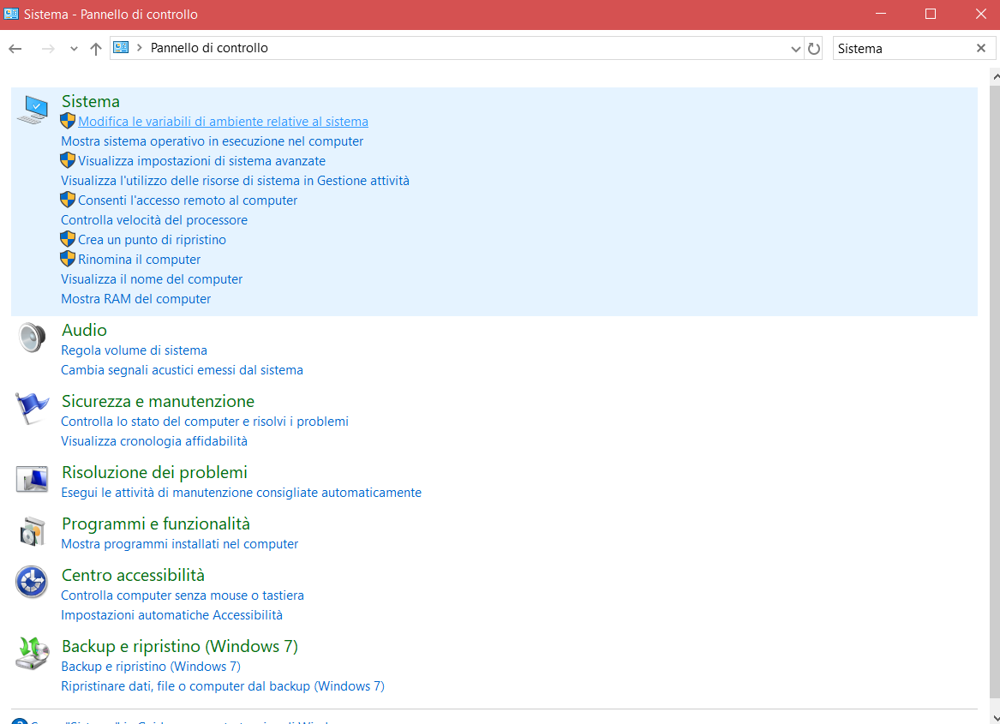
    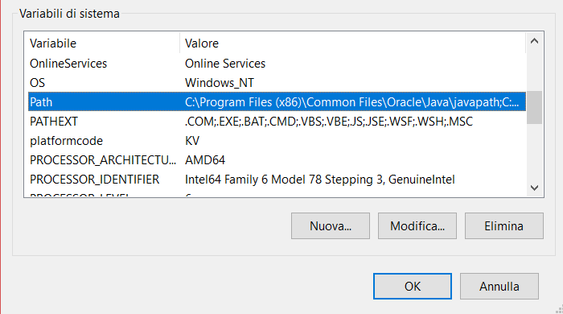
</div>

<div class="page-break"></div>

## Driver USB

Per fare in modo che il computer individui il dispositivo LEGO&reg;, &egrave; necessario disporre di un
driver USB. Esso si scarica dal sito ufficiale Mindstorms
([https://www.lego.com/r/www/r/mindstorms/-/media/franchises/mindstorms%202014/downloads/firmware%20and%20software/nxt%20software/nxt%20fantom%20drivers%20v120.zip?l.r2=-964392510](https://www.lego.com/r/www/r/mindstorms/-/media/franchises/mindstorms%202014/downloads/firmware%20and%20software/nxt%20software/nxt%20fantom%20drivers%20v120.zip?l.r2=-964392510))
e bisogner&agrave; avviare il file `setup.exe` sotto la cartella `Windows` che si trova nella cartella
compressa appena scaricata.  
Quindi verificare che il brick NXT sia riconosciuto dal vostro PC aprendo `Gestione dispositivi` dal
`Pannello di controllo` e il dispositivo verrà identificato in questo modo:

<p style="text-align:center;">
    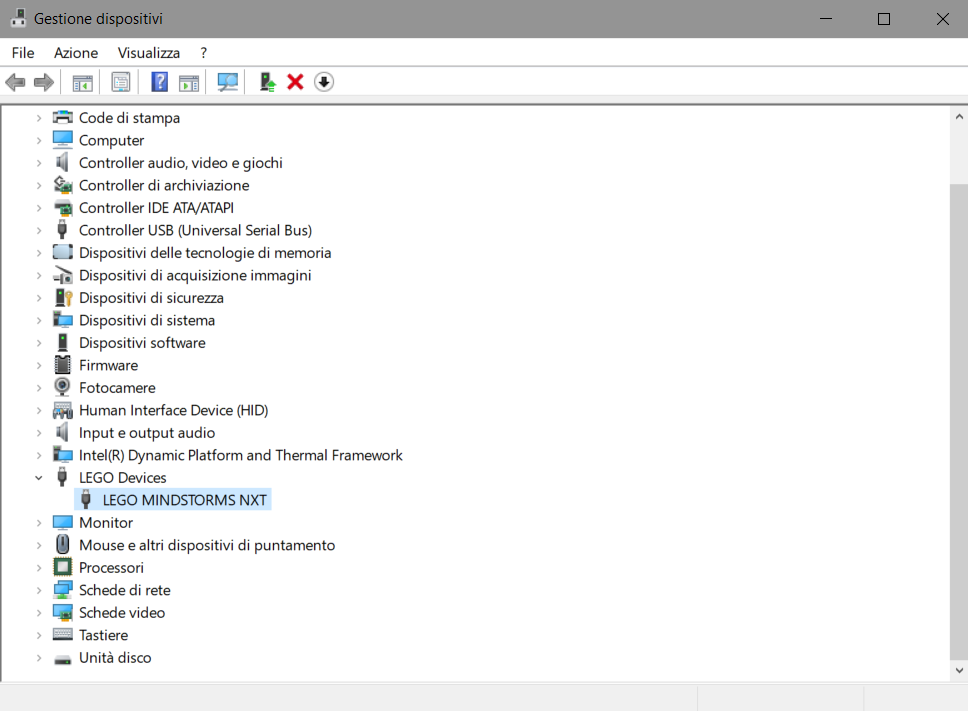
</p>

<div class="page-break"></div>

## leJOS

### Installazione
Procedere scaricando l'applicativo dell'ultima versione (0.9.1) dal sito
([https://sourceforge.net/projects/nxt.lejos.p/files/latest/download](https://sourceforge.net/projects/nxt.lejos.p/files/latest/download)).
Quindi avviare il file appena scaricato e eseguire la procedura guidata dell'installer.

### Configurazione

Assicurarsi che il brick sia acceso collegato correttamente via USB, successivamente finire la
configurazione avviando la finestra finale dove è attivata l'opzione `Launch NXJ Flash utility`.
L'applicazione dovrebbe identificare il brick, quindi cliccare `Start program` e procedere con
l'attivazione del firmware.  
Ora la configurazione è giunta al termine e sul NXT dovrebbe apparire la schermata di leJOS.

## Utilizzo

In questo capitolo viene spiegato come iniziare a programmare con leJOS NXJ tramite un classico
`HelloWorld`. &Egrave; solamente necessario disporre di un editore di testo per scrivere il codice.

### HelloWorld

Iniziare creando il file `HelloWorld.java` e scrivendo la classe `HelloWorld` tramite il pacchetto
predefinito di Java.

```java
public class HelloWorld {

}
```

Proseguire implementando il metodo `main` (che viene di solito usato come il metodo che genera un
output).

```java
public class HelloWorld {
    public static void main (String[] args) {

    }
}
```

Ora scrivere la classica funzione che genera un output sotto forma di testo nello schermo LCD del
brick.

```java
public class HelloWorld {
    public static void main (String[] args) {
        System.out.println("Hello World");
    }
}
```

Se si avvia il programma in questo modo, verrà mostrata la scritta "HelloWorld" e si tornerà
immediatamente nella schermata principale. Per limitare questo comportamento, si può inserire l'
opzione che aspetta la pressione di un pulsante. Per fare ciò basta importare la libreria `Button` e
inserire un semplice metodo.

```java
import lejos.nxt.Button;

public class HelloWorld {
    public static void main (String[] args) {
        System.out.println("Hello World");
        Button.waitForAnyPress();
    }
}
```

### Compilazione e avvio

Per verificare il funzionamento del codice appena scritto, bisogna aprire un'istanza di
`Windows PowerShell` nella cartella dove si trova il file `HelloWorld.java`, cliccando sul menu
`File` in alto a sinistra e scegliendo `Apri Windows PowerShell`.  
Si dovrebbe aprire una schermata blu, in cui occorre scrivere i seguenti comandi uno dopo l'altro:

```
nxjc HelloWorld.java
```

Compilazione del file.

```
nxjlink -o HelloWorld.nxj HelloWorld  
```

Caricamento della classe in un file compatibile con NXT.

```
nxjupload -r HelloWorld.nxj
```

Caricamento del file nel brick.

```
nxj -r -o HelloWorld.nxj HelloWorld
```

Avviamento del programma.

## lego-lib &amp; IDE

Gli IDE (Integrated Development Environment) sono degli applicativi studiati per facilitare il
compito degli sviluppatori, per poter utilizzare la libreria in un IDE bisogna importare in esso il file
`.jar` che contiene tutte le classi di lego-lib. Per ogni IDE vi è una differente procedura.

<div class="page-break"></div>

# Struttura

Lego-lib, principalmente &egrave; composto da una libreria che usa i blocchi arancioni e quelli
verdi dell'ambiente di sviluppo Mindstorms.

## Blocchi arancioni
Servono per aspettare che un determinato sensore legga un determinato valore, oppure rappresentano le
strutture di controllo di programmazione sequenziale.  
Per esempio si pu&ograve; aspettare che il sensore di luce riflessa legga un valore pi&ugrave; alto del 50%.

I blocchi arancioni rappresentano i blocchi Wait, che in lego-lib sono compresi dalle
 classi contenute nel package `legolib` il cui nome comincia con `Wait`.

Nei blocchi arancioni sono compresi anche le selezioni e i cicli, i quali sono implementati dalle
strutture di controllo `if ()`, `while ()`, `do while ()` oppure `for ()`.

## Wait

Tutte le classi hanno in comune hanno un costruttore che permette di inizializzare ogni attesa con tutte le configurazioni possibili ed un metodo che fa eseguire l'attesa configurata tramite i parametri scelti.

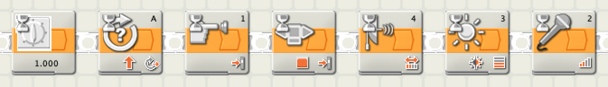

Ogni waiter ha almeno un costruttore, nel quale vi sono tutti i parametri con il quale lo si
configura ed un metodo che inizia con `wait` e finisce con il nome del sencore che deve aspettare,
questo metodo &egrave quello da utilizzare per eseguire lo waiter.

### Sensori analogici

Gli waiter analogici si basano su una variabile contentente il valore di riferimento, questo valore
viene confrontato con quello letto dai sensori. Poi vi &egrave; una variabile booleana, la quale
viene utilizzata per sapere se il valore letto dal sensore deve essere maggiore o minore rispetto a
quello memorizzato nella variabile di riferimento.
Tutto questo &egrave; nella classe `WaitAnalogSensor`, che viene estesa dalle classi dei
sensori analogici.

Diagramma UML della classe `WaitAnalogSensor`:

<p style="text-align:center;">
    
</p>

<div class="page-break"></div>

### WaitTime

<div class="clearfix">
    <div style="float:left">
        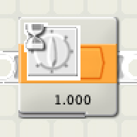
    </div>
    <div style="float:left;padding: 20px 0 0 10px; max-width:428px">
        Il blocco wait time dell'ambiente di sviluppo Mindstorms &egrave; rappresentato dalla
        classe&nbsp; `WaitTime`, la quale permette di aspettare del tempo definito in millisecondi.
    </div>
</div>

<br>
Il diagramma UML della classe:

<p style="text-align:center;">
    
</p>

La classe WaitTime &egrave; stata fatta per mantenere la coerenza con le altre classi, ma pu&ograve; essere facilmente sostituita da un `Thread.sleep(millis);`.

Esempio di utilizzo della classe in maniera **asincrona**:

```java
import lejos.nxt.Button;

/**
 * Classe che aspetta del tempo.
 * Si crea un oggetto WaitTime impostando il tempo a 5000 millisecondi.
 *
 * @author gabrialessi
 * @author giuliobosco
 * @version 1.2 (2019-02-07)
 */
public class UseWaitTime {

    /**
     * Metodo main, si esegue il test facendo l'attesa.
     *
     * @param args Argomenti a linea di comando.
     */
    public static void main(String[] args) {
        // Creazione di un'attesa di 5000 millisecondi (5 secondi).
        WaitTime wait = new WaitTime(5000);
        // Esecuzione dell'attesa.
        System.out.println("Aspettando...");
        wait.waitTime();
        System.out.println("Attesa terminata.");
        // Fine del test dopo la pressione un pulsante.
        Button.waitForAnyPress();
    }
}
```

<div class="page-break"></div>

Oppure al posto della classe WaitTime, come detto in precedenza si
pu&ograve; utilizzare il metodo `Thread.sleep(5000);`, che &egrave; un
metodo compreso nelle librerie di Java.

```java
import lejos.nxt.Button;

/**
 * Attesa tramite Thread.sleep(millis).
 * Questa classe è un'alternativa a WaitTime.
 *
 * @author giuliobosco
 * @author gabrialessi
 * @version 1.1 (2019-02-07)
 */
public class UseThreadSleep {

    /**
     * Metodo main, si esegue il test facendo l'attesa.
     *
     * @param args Argomenti a linea di comando.
     */
    public static void main(String[] args) {
        // Il metodo Thread.sleep() solleva un'eccezione, quindi bisogna
        // fare un try-catch della InterruptedException.
        try {
            // Effettuo l'attesa di 5000 millisecondi (5 secondi).
            System.out.println("Aspettando...");
            Thread.sleep(5000);
        } catch (InterruptedException ie) {
            ie.printStackTrace();
        }
        // Messaggio di conclusione.
        System.out.println("Attesa terminata.");
        // Fine del test dopo la pressione un pulsante.
        Button.waitForAnyPress();
    }
}
```

<div class="page-break"></div>

### Wait Motor

<div class="clearfix">
    <div style="float:left">
        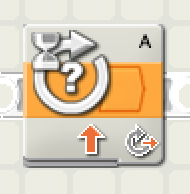
    </div>
    <div style="float:left;padding: 12px 0 0 10px; max-width:428px">
        Il blocco wait motor dell'ambiente di sviluppo Mindstorms &egrave; rappresentato dalla
        classe&nbsp;`WaitMotor`, la quale permette di aspettare che il motore abbia effettuato
        un determinato numbero di rotazioni.
    </div>
</div>

<br>

Il diagramma UML della classe:

<p style="text-align:center;">
    
</p>

Esempio di utlizzo della classe:

```java
import lejos.nxt.Button;

/**
 * Esempio di come usare la classe WaitMotor.
 * In questo caso si aspettano tre rotazioni dal motore impostato.
 *
 * @author giuliobosco
 * @author gabrialessi
 * @version 1.1 (2019-02-07)
 */
public class UseWaitMotor {

    /**
     * Metodo main, si esegue il test impostando il motore
     * e facendo l'attesa di tre rotazioni.
     *
     * @param args Argomenti a linea di comando.
     */
    public static void main(String[] args) {
        // Imposto il motore sulla porta 'A'.
        SingleMotor m = new SingleMotor('A');
        // Creazione dell'attesa di 3 rotazioni.
        WaitMotor wait = new WaitMotor(m, 3);
        // Imposto la velocità del motore a 10%.
        System.out.println("Avvio motore.");
        m.setPower((byte) 10);
        // Avvio del motore.
        m.start();
        // Attesa delle 3 rotazioni.
        wait.waitMotor();
        // Arresto del motore.
        System.out.println("Fermo motore.");
        m.stop();
        // Fine del test dopo la pressione un pulsante.
        Button.waitForAnyPress();
    }
}
```

### Wait Touch Sensor

<div class="clearfix">
    <div style="float:left">
        
    </div>
    <div style="float:left;padding: 12px 0 0 10px; max-width:428px">
        Il blocco wait touch dell'ambiente di sviluppo Mindstorm NXT &egrave; rappresentato dalla
        classe&nbsp;`WaitTouchSensor`, la quale permette di aspettare che un sensore di tocco venga premuto, rilasciato oppure cliccato, cioè cliccato e rilasciato.
    </div>
</div>

<br>

Il diagramma UML della classe:

<p style="text-align:center;">
    
</p>

Per sceglirere quale delle tre azioni aspettare (premuto, rilasciato o cliccato), bisosgna cambiare il
valore `waitAction` nel costruttore dell'attesa con:

- `PRESSED` per pressione,
- `RELEASED` per rilascio,
- `CLICKED` per click.

Esempio di utlizzo della classe:

```java
import lejos.nxt.Button;
import lejos.nxt.SensorPort;

/**
 * Esempio d'uso di WaitTouchSensor.
 * Si aspetta la pressione di un sensore di tocco. Il sensore può essere
 * impostato sulle altre porte e avere l'azione di attesa differente
 * (premuto, rilasciato, cliccato).
 *
 * @author giuliobosco
 * @author gabrialessi
 * @version 1.2 (2019-02-07)
 */
public class UseWaitTouchSensor {

    /**
     * Metodo main, si esegue il test attendendo la pressione del sensore.
     *
     * @param args Argomenti a linea di comando.
     */
    public static void main(String[] args) {
        // Creazione dell'attesa di un sensore sulla porta 1.
        WaitTouchSensor wait = new WaitTouchSensor(SensorPort.S1, WaitTouchSensor.CLICKED);
        // Attesa del click del sensore.
        System.out.println("Cliccare il sensore sulla porta 1.");
        wait.waitTouch();
        System.out.println("Cliccato.");
        // Fine del test dopo la pressione un pulsante.
        Button.waitForAnyPress();
    }
}
```

<div class="page-break"></div>

### Wait NXT Button

<div class="clearfix">
    <div style="float:left">
        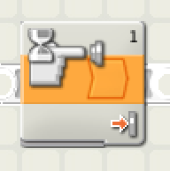
    </div>
    <div style="float:left;padding: 12px 0 0 10px; max-width:428px">
        Il blocco wait NXT button dell'ambiente di sviluppo Mindstorm NXT &egrave; rappresentato dalla
        classe&nbsp;`WaitNxtButton`, che permette di aspettare che venga premuto uno specifico
        pulsante sul brick NXT.
    </div>
</div>

<br>

Il diagramma UML della classe:

<p style="text-align:center;">
    
</p>

Per ogni pulsante vi è un metodo statico che aspetta il suo click.

- pulsante sinistro: `WaitNxtButton.leftButton()`,
- pulsante invio: `WaitNxtButton.enterButton()`,
- pulsante destro: `WaitNxtButton.rightButton()`,
- pulsante indietro: `WaitNxtButton.escapeButton()`.

Esempio di utlizzo della classe:

```java
import lejos.nxt.Button;

/**
 * Classe in cui si usano i metodi della classe WaitNxtButton.
 * I metodi aspettano la pressione dei pulsanti del brick:
 * sinistro, enter, destro e indietro (escape).
 *
 * @author giuliobosco
 * @author gabrialessi
 * @version 1.3 (2019-02-06)
 */
public class UseWaitNxtButton {

    /**
     * Metodo main, si esegue il test chiamando tutti i metodi
     * della classe WaitNxtButton.
     *
     * @param args Argomenti a linea di comando.
     */
    public static void main(String[] args) {
        // Attesa del pulsante sinistro.
        System.out.println("Premere il pulsante sinistro.");
        WaitNxtButton.leftButton();
        // Attesa del pulsante enter.
        System.out.println("OK\n\nPremere il pulsante enter.");
        WaitNxtButton.enterButton();
        // Attesa del pulsante destro.
        System.out.println("OK\n\nPremere il pulsante destro.");
        WaitNxtButton.rightButton();
        System.out.println("OK\n\n");
        // Attesa del pulsante indietro.
        System.out.println("OK\n\nPremere il pulsante indietro.");
        WaitNxtButton.escapeButton();
        System.out.println("OK\n\n");
        // Fine del test dopo la pressione un pulsante.
        System.out.println("Fine.");
        Button.waitForAnyPress();
    }
}
```

<div class="page-break"></div>

### Wait Ultrasonic Sensor

<div class="clearfix">
    <div style="float:left">
        
    </div>
    <div style="float:left;padding: 12px 0 0 10px; max-width:428px">
        Il blocco wait ultrasonic dell'ambiente di sviluppo Mindstorms &egrave; rappresentato dalla
        classe&nbsp;`WaitUltrasonicSensor`, la quale permette di aspettare del che un sensore a
        ultrasuoni percepisca un valore pi&ugrave; alto o pi&ugrave; basso di un valore di riferimento.
    </div>
</div>

<br>

Come descritto nel capitolo `Wait > Sensori analogici`, i valori di riferimento sono gestiti nella
classe `WaitAnalogSensor`.

Il diagramma UML della classe:

<p style="text-align:center;">
    
</p>

Esempio di utlizzo della classe:

```java
import lejos.nxt.Button;
import lejos.nxt.SensorPort;

/**
 * Esempio d'uso della classe WaitUltrasonicSensor.
 * Prima si aspetta una distanza maggiore di 50cm dal sensore, poi
 * una minore di 50cm.
 *
 * @author giuliobosco
 * @author gabrialessi
 * @version 1.1 (2019-02-07)
 */
public class UseWaitUltrasonicSensor {

    /**
     * Metodo main, si esegue il test aspettando dal sensore a ultrasuoni
     * una distanza maggiore di 50cm e poi una minore di 50cm.
     *
     * @param args Argomenti a linea di comando.
     */
    public static void main(String[] args) {
        // Creazione dell'attesa del sensore a ultrasuoni nella porta 1,
        // con il valore che deve essere maggiore di 50.
        WaitUltrasonicSensor wait = new WaitUltrasonicSensor(SensorPort.S1, (byte) 50, true);
        // Inizio dell'attesa.
        System.out.println("Mettere il sensore più lontano di 50cm.");
        wait.waitUltrasonic();
        // Attesa della pressione di un qualsiasi pulsante sul brick.
        Button.waitForAnyPress();
        // Ora si aspetta un valore minore di 50cm.
        wait.setBigger(false);
        System.out.println("Mettere il sensore più vicino di 50cm.");
        wait.waitUltrasonic();
        // Fine del test dopo la pressione un pulsante.
        System.out.println("Fine.");
        Button.waitForAnyPress();
    }
}
```

<div class="page-break"></div>

### Wait Light Sensor

<div class="clearfix">
    <div style="float:left">
        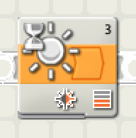
    </div>
    <div style="float:left;padding: 12px 0 0 10px; max-width:428px">
        Il blocco wait light dell'ambiente di sviluppo Mindstorms &egrave; rappresentato dalla
        classe&nbsp;`WaitLightSensor`, che permette di aspettare del che un sensore di
        luce percepisca un valore pi&ugrave; alto o pi&ugrave; basso di un valore di riferimento.
    </div>
</div>

<br>

Come descritto nel capitolo `Wait > Sensori analogici` i valori di riferimento sono gestiti nella
classe `WaitAnalogSensor`.

Il diagramma UML della classe:

<p style="text-align:center;">
    
</p>

Esempio di utlizzo della classe:

```java
import lejos.nxt.Button;
import lejos.nxt.SensorPort;

/**
 * Esempio d'uso della classe WaitLightSensor.
 * Si aspetta una luce chiara e successivamente una luce scura.
 *
 * @author giuliobosco
 * @author gabrialessi
 * @version 2.1 (2019-02-06)
 */
public class UseWaitLightSensor {

    /**
     * Metodo main, si esegue il test aspettando dal sensore di luce
     * una luce chiara e poi una luce scura.
     *
     * @param args Argomenti a linea di comando.
     */
    public static void main(String[] args) {
        // Creazione dell'attesa del sensore di luce nella porta 1,
        // con il valore che deve essere maggiore di 50 (chiaro).
        WaitLightSensor wait = new WaitLightSensor(SensorPort.S1, (byte) 50, true);
        // Inizio dell'attesa.
        System.out.println("Mettere il sensore su una superficie chiara.");
        wait.waitLight();
        // Attesa della pressione di un qualsiasi pulsante sul brick.
        Button.waitForAnyPress();
        // Ora si aspetta un valore minore di 50 (scuro).
        wait.setBigger(false);
        System.out.println("Mettere il sensore su una superficie scura.");
        wait.waitLight();
        // Fine del test dopo la pressione un pulsante.
        System.out.println("Fine.");
        Button.waitForAnyPress();
    }
}
```

<div class="page-break"></div>

#### Calibrazione sensori

Per poter utilizzare in maniera ottimale i sensori, bisogna calibrarli con la luce attuale dell'
ambiente circostante.  
Per calibrare i sensori bisogna settare la luce massima e la luce minima che pu&ograve; leggere il
sensore. La luce massima che un sensore pu&ograve; leggere solitamente &egrave; intesa come il
bianco, che riflette molta luce; mentre la luce minima che il sensore pu&ograve; leggere &egrave; il nero,
che riflette pochissima luce.

Per fare la calibrazione si pu&ograve; usare il seguente codice:

```java
import lejos.nxt.LightSensor;
import lejos.nxt.SensorPort;

/**
 * Classe utile per calibrare il sensore di luce.
 * Si calibra il sensore usando come riferimento il bianco e il nero.
 * In questo modo è tutto proporzionale all'ambiente di lavoro.
 *
 * @author giuliobosco
 * @author gabrialessi
 * @version 1.1 (2019-02-07)
 */
public class LightSensorCalibrator {

    /**
     * Metodo main, si calibrano nero e bianco tramite
     * i metodi della classe LightSensor e un sensore di luce.
     *
     * @param args Argomenti a linea di comando.
     */
    public static void main(String[] args) {
        // Imposto il sensore di luce sulla porta 1.
        LightSensor ls = new LightSensor(SensorPort.S1);
        // Configurazione luce bianca.
        System.out.println("Mettere il sensore sul bianco e premere enter.");
        WaitNxtButton.enterButton();
        ls.calibrateHigh();
        System.out.println("\n\n\n\n\n\n\n\n\n");
        // Configurazione luce nera.
        System.out.println("Mettere il sensore sul nero e premere enter.");
        WaitNxtButton.enterButton();
        ls.calibrateLow();
    }
}
```

<div class="page-break"></div>

### Wait Sound Sensor

<div class="clearfix">
    <div style="float:left">
        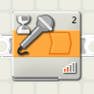
    </div>
    <div style="float:left;padding: 12px 0 0 10px; max-width:428px">
        Il blocco wait sound dell'ambiente di sviluppo Mindstorms è rappresentato dalla
        classe&nbsp;`WaitSoundSensor`, la quale permette di aspettare del che un sensore di
        souno (microfono) percepisca un valore pi&ugrave; alto o pi&ugrave; basso di un valore di riferimento.
    </div>
</div>

<br>

Come descritto nel capitolo `Wait > Sensori analogici` i valori di riferimento sono gestiti nella
classe `WaitAnalogSensor`.

Il diagramma UML della classe:

<p style="text-align:center;">
    
</p>

Esempio di utlizzo della classe:

```java
import lejos.nxt.Button;
import lejos.nxt.SensorPort;

/**
 * Esempio d'uso della classe WaitSoundSensor.
 * Il microfono aspetta che recepisca un suono forte.
 *
 * @author giuliobosco
 * @author gabrialessi
 * @version 1.1 (2019-02-06)
 */
public class UseWaitSoundSensor {

    /**
     * Metodo main, si esegue il test aspettando dal microfono
     * un suono forte.
     *
     * @param args Argomenti a linea di comando.
     */
    public static void main(String[] args) {
        // Creazione attesa di un suono superiore al 50.
        WaitSoundSensor wait = new WaitSoundSensor(SensorPort.S1, (byte) 50, true);
        // Esecuzione dell'attesa.
        System.out.println("Parlare davanti al microfono.");
        wait.waitSound();
        System.out.println("OK.");
        // Fine del test dopo la pressione un pulsante.
        Button.waitForAnyPress();
    }
}
```

<div class="page-break"></div>

## Strutture di controllo

<div class="clearfix">
    <div style="float:left">
        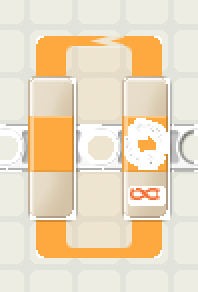
    </div>
    <div style="float:left;; padding: 25px 0 0 30px">
        <p>
            La struttura di controllo del ciclo pu&ograve; essere rappresentata in diverse maniere:
        </p>
        <ul>
            <li>`while (...) { ... }`</li>
            <li>`do { ... } while (...)`</li>
            <li>`for (...;...;...) { ... }`</li>
        </ul>
    </div>
</div>

<br>

<div class="clearfix">
    <div style="float:left">
        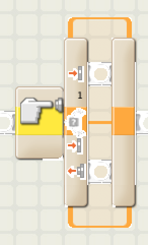
    </div>
    <div style="float:left; padding: 50px 0 0 30px">
        <p>
            La struttura di controllo dello switch o selezione in programmazione &egrave;<br> rappresentata dalla struttura di controllo `if (...) { ... }`.
        </p>
    </div>
</div>


<div class="page-break"></div>

## Blocchi verdi

I blocchi verdi dell'ambiente di sviluppo LEGO&#174; Mindstorms sono quelli relativi agli
attuatori.  
Gli attuatori possono essere:

- Motori,
- Schermi,
- Display,
- Led,
- Buzzer,
- Altoparlanti.

Quindi sono tutti quegli elementi che collegati ad un circuito di controllo, a dipendenza della
loro natura e dell'istruzione o segnale che gli viene invato, fanno dei movimenti o modificano il
loro stato.

In questa libreria ci sono principalmente due classi di attuatori, perch&eacute; le altre gi&agrave; sono
state implementate dalla libreria interna di leJOS.

- Motore singolo,
- Navigazione.

La gestione dei motori &egrave; stata suddivisa in due classi differenti: una per il motore singolo, mentre
l'altra per la navigazione a due motori (per navigazione si intende il movimento del robot con due
motori che lavorano in sintonia).

La gestione del display &egrave; gia implementata dalla classe `System.in`, mentre le funzioni audio sono
implementate nella classe `lejos.nxt.Sound`.

### Motore singolo

<div class="clearfix">
    <div style="float:left">
        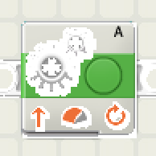
    </div>
    <div style="float:left;padding: 20px 0 0 10px; max-width:428px">
        Il blocco motor (per il motore singolo) dell'ambiente di sviluppo Mindstorms &egrave;
        rappresentato dalla classe&nbsp;`SingleMotor`, che permette di gestire facilmente un
        motore.
    </div>
</div>

<br>

Il diagramma UML della classe:

<p style="text-align:center;">
    
</p>

<div class="page-break"></div>

### Navigazione

<div class="clearfix">
    <div style="float:left">
        
    </div>
    <div style="float:left;padding: 20px 0 0 10px; max-width:428px">
        Il blocco motor (per la navigazione) dell'ambiente di sviluppo Mindstorms &egrave;
        rappresentato dalla classe&nbsp;`Navigation`, la quale permette di manovrare con
        facilit&agrave; i motori.
    </div>
</div>

<br>

Il diagramma UML della classe:

<p style="text-align:center;">
    
</p>

Per poter manovrare i motori bisogna impostare la velocit&agrave; con il metodo `setPower(power)`,
mentre per manovrare la direzione bisogna usare il metodo `setTurning(turning)`. Poi &egrave; necessario avviare
la navigazione con il metodo `start()` e pu&ograve; essere fermata con il metodo
`stop()`.
